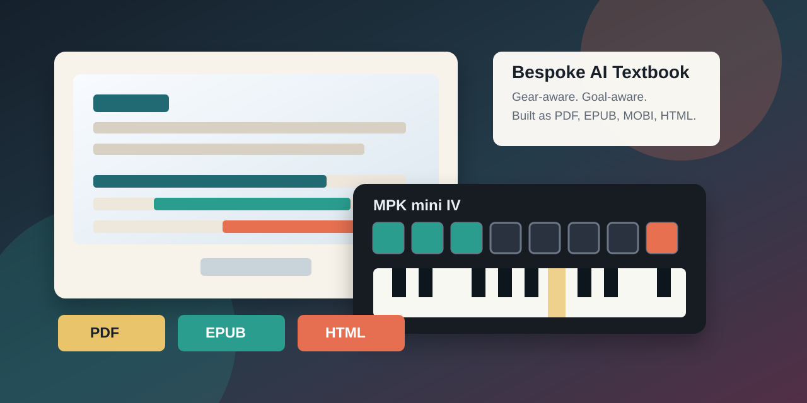

# Music Learning Manuals

This repository is an experiment in bespoke, AI-aligned learning books:
practical textbooks and interactive guides built around one learner's actual
gear, goals, musical references, taste, and next practice session.



## Deliverables

- [Latest PDF manual](codex/docs/book/dist/kiffness-mpk-mini-manual%20(0.3.1).pdf)
- [Latest EPUB manual](codex/docs/book/dist/kiffness-mpk-mini-manual%20(0.3.1).epub)
- [Latest MOBI manual](codex/docs/book/dist/kiffness-mpk-mini-manual%20(0.3.1).mobi)
- [MPK Mini MK3 GarageBand Loop Lab](codex/docs/mpk-mini-mk3-garageband-loop-lab.html)
- [MPK Mini MK3 Ableton Live Loop Lab](codex/docs/mpk-mini-mk3-ableton-loop-lab.html)
- [What Is Love GarageBand animated tutorial](codex/docs/what-is-love-garageband-animated.html)
- [Don't Cry Tonight GarageBand animated tutorial](codex/docs/dont-cry-tonight-garageband-animated.html)
- [Clint Eastwood MPK Mini animated tutorial](codex/docs/clint-eastwood-mpk-mini-animated.html)
- [What Is Love figure-by-figure settings guide](codex/docs/WhatIsLoveGarageBandFigures.md)
- [Don't Cry Tonight figure-by-figure settings guide](codex/docs/DontCryTonightGarageBandFigures.md)
- [Changelog](codex/CHANGELOG.md)

## What This Is

The current book is an Akai MPK Mini MK3 loop manual for learning the actual
controller surface: keys, pads, banks, knobs, note repeat, arpeggiator,
joystick, programs, GarageBand loops, and Ableton Live clips.

The interactive tutorials include both GarageBand and Ableton Live practice
paths. GarageBand is treated as the simplest first loop environment; Ableton
Live is treated as the clip-launching and MIDI-mapping environment.

## Bespoke AI-Aligned Textbooks

This project follows the learning approach described in Dr. Alexy Khrabrov's
Chief Scientist post, [Learn Rust from Bespoke Books](https://chiefscientist.org/learn-rust-from-bespoke-books-69e1d853dbca).
The idea is that a book can be coauthored around a learner's real context
instead of delivered as a generic static curriculum.

Dr. Alexy Khrabrov is pioneering a practical pattern for AI-aligned learning
books: use AI as a collaborative curriculum engine that listens to the learner,
tracks their actual tools and goals, and produces durable learning artifacts
they can use immediately. The alignment is not abstract. It is visible in the
examples, exercises, diagrams, formats, and next steps.

For this music manual, that means the material is aligned to:

- the actual controller: Akai MPK mini IV;
- the actual beginner DAW paths: GarageBand and Ableton Live;
- the learner's musical references, including Kiffness-style remix videos,
  MunomaMusic's "What Is Love" live-loop cover, the Savage / John E.S
  "Don't Cry Tonight" remix, and Smith's Covers' Akai MPK Mini "Clint
  Eastwood" cover;
- the actual workflow goal: make playable, filmable remix studies, not merely
  read about production;
- the preferred output formats: PDF, EPUB, MOBI, Markdown guides, and animated
  browser tutorials.

This is AI-aligned in the practical learning sense: the AI collaborator is not
trying to replace the learner's taste or agency. It is aligning explanations,
examples, structure, artifacts, and next actions to the learner's stated
purpose. The result is a personal textbook that can evolve as the learner's rig,
skill, and ambitions evolve.

## Repository Layout

- `codex/docs/book/manual.md` - main manuscript.
- `codex/docs/book/build.sh` - PDF/EPUB/MOBI build script.
- `codex/docs/book/dist/` - versioned release artifacts.
- `codex/docs/*.md` - companion settings guides and research notes.
- `codex/docs/*.html` - interactive GarageBand tutorials.
- `codex/CHANGELOG.md` - release notes for the manual.
- `claude/` - earlier manual-generation work kept for continuity.

## Build

From the repository root:

```sh
cd codex
docs/book/build.sh
```

The build writes stable artifacts plus versioned release files based on
`codex/docs/book/VERSION`.

To regenerate the GitHub Pages homepage from this README:

```sh
scripts/build-pages-readme.sh
```

## Rights

This repository is for personal learning and study. The manual references
public videos and official product documentation, but it does not include copied
lyrics, transcripts, copyrighted video frames, or source audio in the published
manual artifacts. Use your own recordings, licensed material, public-domain
sources, or material you have permission to remix.
