# Your first repeatable voice recording

This book is built around the equipment on your desk: a BeesNeez B67-269 tube microphone, a United **Studio Technologies** UT Twin87, a Golden Age **PRE-73 Premier**, a COMP-54 compressor, and a MOTU M4 connected to a Mac. The title **Professional Podcat Audio** preserves the name chosen for this project. The purpose is simple: make a voice recording you can trust, repeat it tomorrow, and hear what each microphone and control really changes.

A professional result is a repeatable process. Your voice, distance from the capsule, room reflections and performance matter before a compressor or EQ. We will first record a clean reference, then add modest processing, then compare equal-loudness copies. You will finish with a saved session and a recall sheet that covers the whole chain.

## What is verified, and what you must measure

**Manufacturer facts** describe what a jack, switch or software control does. They are linked to the official documents in the source register. **Starting recipes** are editorial suggestions for spoken voice. They have not been acoustically tested on your voice or in your room. A gain number, threshold or distance in a recipe is a place to begin, not a promise of the best sound. **Your measured result** is the meter reading and listening note you write down after recording.

The photographs in this book are your supplied images from `gear/`. They identify the PRE-73 Premier and show the real microphone and stack. They do not establish hidden rear wiring, switch engagement or the precise compressor revision. A perspective photo is not a calibrated recall sheet. The color diagrams are original teaching illustrations, not manufacturer screenshots or pixel-accurate panel drawings.

The main hardware path uses the M4's rear **LINE IN 3**. That keeps the signal from the external preamp and compressor out of the M4's adjustable front gain stage. We will monitor a centered mono track through the DAW. A separate alternative explains how to use the front TRS input when you need centered direct monitoring.

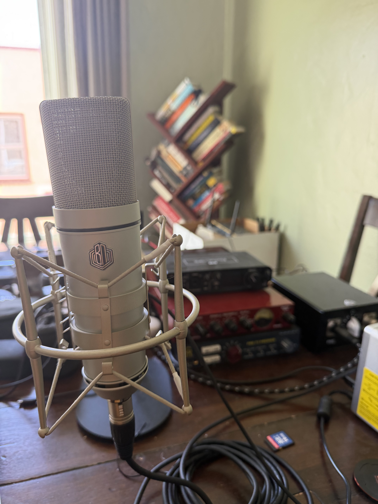{width=68%}

## Three working sessions

1. **First sound, about 30 minutes.** Connect one microphone, set safe power, bypass compression, choose mono Input 3, rehearse loudly, then record a minute of speech.
2. **Comparison, about 60 minutes.** Capture the BeesNeez as found and both Twin87 modes. Add the four internal BeesNeez profiles only after its manufacturer confirms the safe handling procedure for your revision. Match speech loudness, blind the labels, and score the result. Repeat the top two at different distances.
3. **Production template, about 45 minutes.** Choose one setup, add only needed filtering and compression, edit a short episode, export and listen to the complete file.

If you already have a recording, retain it. Save a new project for this work so old plug-ins, normalization settings and routings cannot silently color the test.

## A four-line safety card

- **BeesNeez:** use its matching power supply and supplied multipin cable. Keep PRE-73 phantom **OFF**.
- **Twin87:** use an ordinary balanced XLR mic cable. Turn PRE-73 phantom **ON only after connecting** the microphone.
- **Both:** keep M4 phantom **OFF** in the outboard chain. The PRE-73 already supplies any required mic gain and phantom.
- **Every change:** lower headphone/speaker levels and stop recording before changing cables, power or microphone modes. Follow the device's own instructions for its supplied power system.

A tube mic supply is not a generic phantom-power adapter. Never experiment with a multipin cable from another microphone. Do not open a powered supply or service mains circuits. If the BeesNeez model, cable or switch plate differs from the linked guide, use the matching guide before changing it.

## The minimum accessory kit

Have the microphone's proper mount, a pop filter, a stable stand, closed-back headphones, a balanced XLR mic cable, balanced line cables between outboard units, a balanced cable ending in a TRS quarter-inch plug for M4 Input 3, and the M4's USB connection. The BeesNeez adds its own supply and supplied mic cable. The gear photos do not show every rear connector; confirm the sockets before powering up.

Use one balanced output per link. XLR and TRS describe connector formats; they do not by themselves mean microphone level. The signal leaving the PRE-73 is line level. Label the destination end of each cable: `PRE IN`, `COMP IN`, `M4 IN 3`.

# Read the desk before turning a knob

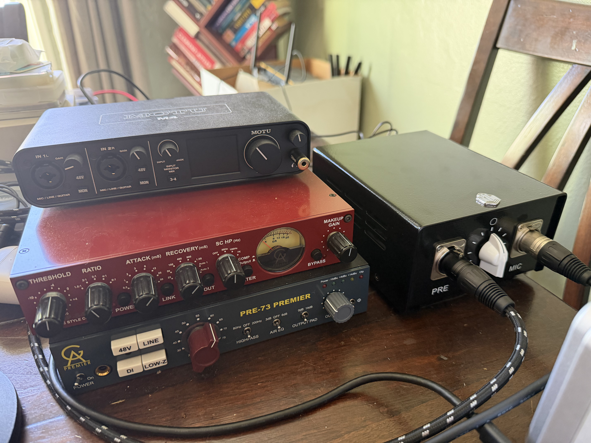

The photo identifies the preamp as **PRE-73 PREMIER**, not a generic PRE-73 MkII or MkIII. Its high-pass filter, Air EQ and output pad deserve their own entries in every recall sheet. The compressor photo shows threshold, ratio, attack, recovery, sidechain HP, makeup, meter selector, power, link, compression in/out and bypass controls. Follow the panel legends when a manual covers a different revision.

## The signal path, in plain language

The microphone turns pressure into a small electrical signal. The PRE-73 raises that signal to a usable analog line level. The COMP-54 can reduce dynamic range before the signal reaches the interface. The M4 converts the analog signal into digital samples. GarageBand or Live stores those samples on an audio track. Software effects and editing shape the finished program after capture.

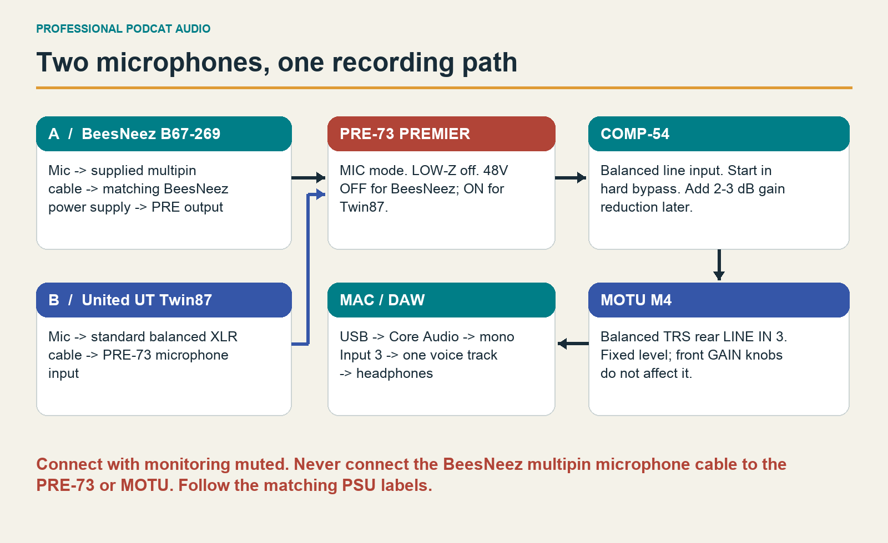

The order matters. Turning a DAW fader down cannot undo a clipped microphone, overloaded preamp or clipped converter. Conversely, a quiet-looking waveform can still contain analog distortion if you used too much preamp gain and then turned its output down. Listen and watch the meter at each stage.

## The 12-step cable and power sequence

1. Stop the DAW transport. Turn headphones down. Mute or turn down speakers.
2. Turn PRE-73 48V off. Leave both M4 48V buttons off. Power down the BeesNeez supply before attaching or removing its microphone cable; allow it to discharge according to its supplied instructions.
3. Mount the chosen mic securely. Do not let a heavy cable pull sideways on its connector.
4. For the BeesNeez, connect the supplied multipin cable from mic to matching PSU `MIC`. Connect PSU `PRE` output to the PRE-73 microphone input with the appropriate balanced XLR lead. For the Twin87, connect mic XLR directly to the PRE-73 microphone input.
5. Connect the PRE-73 balanced main output to the COMP-54 balanced input. Do not use the preamp's unbalanced insert for this baseline.
6. Connect the COMP-54 balanced output to M4 rear `LINE IN 3`, using a balanced TRS plug at the M4. Leave Input 4 unused.
7. Connect M4 by USB to the Mac. Connect headphones to the M4. Keep speaker level low.
8. Set the PRE-73 to mic mode: LINE off, DI off, LOW-Z off, polarity normal, high-pass off, Air off, output pad 0 dB. Begin with gain 30 dB and output at or near maximum; lower gain or trim output if the rehearsal needs less level.
9. Power the PRE and compressor; engage COMP-54 hard bypass. Leave the compressor's makeup gain at minimum; it has no calibrated dB scale.
10. For BeesNeez only, turn on its matching supply with PRE phantom still off. Allow the microphone to settle; make a fresh level check after it is stable. This book does not invent a manufacturer warm-up duration.
11. For Twin87 only, with cabling complete and monitors down, turn on PRE phantom and let the mic settle. Choose cardioid and the desired mode. Its manual calls for about ten seconds of stabilization after Vintage/Modern changes.
12. Select M4 input and output in the DAW, create mono Input 3, raise headphones gently, rehearse your loudest line and calibrate.

For shutdown, stop recording and lower monitors first. Turn Twin87 phantom off and allow discharge before unplugging. Turn off the BeesNeez supply and follow its discharge guidance before disconnecting its mic. Turn off unused hardware. Do not patch live microphones to save a few seconds.

## Place the microphone before calibrating

Start around **20 cm mouth-to-capsule**, with a pop filter between you and the mic and the mic about 15-30 degrees to the side of your direct breath. Both microphones are side-address models. Speak toward the front capsule face rather than the top of the grille. For the Twin87 the front is the side with its logo and controls identified in the manual; for the BeesNeez use the marked front shown in its guide.

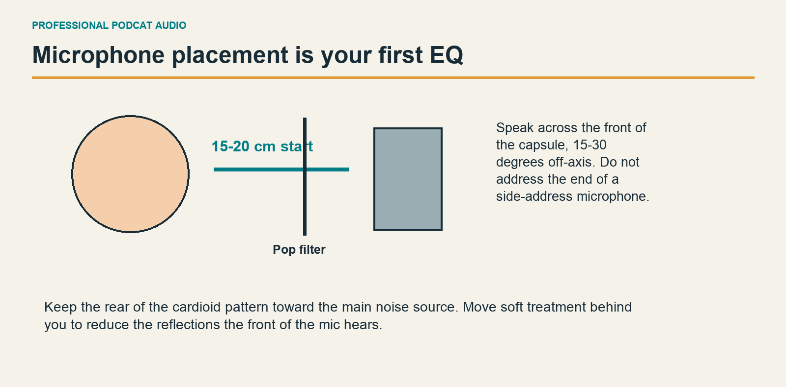

Mark the stand and chair positions. Keep the capsule near mouth height. Point the rear of a cardioid mic toward the strongest unwanted noise when practical. Place soft absorption behind the speaker to catch the reflections that return toward the mic's sensitive front. Keep the mic away from a large bare desktop when possible; a boom or raised stand can help. Test a folded blanket or absorber safely positioned out of frame before buying anything.

Record ten seconds of room tone. Listen for computer fans, street sound, heating, loose cables touching the stand, chair squeaks and table taps. Fix the largest physical cause before turning on a gate. A gate cannot remove noise while you are speaking.


# Choose the microphone's starting state

Start with a setting you can identify, photograph and repeat. A microphone's switches change what arrives at the preamp, so choose them before calibrating gain. The clean reference leaves optional tone shaping off wherever you can verify it. An unknown internal switch stays **as found, unverified** in your notes; the book does not infer its position from the microphone's appearance.

## BeesNeez: begin with the external controls

Use its matching power supply and cable, with PRE-73 phantom off. Select the **cardioid symbol** on the supply's pattern knob. Cardioid favors the front and reduces pickup from behind; it is a useful first choice for one speaker. Read the symbols rather than copying a clock position from a perspective photograph. The nine positions span omni, cardioid, figure-eight and intermediate patterns. Other patterns are experiments for a particular room or arrangement, not automatic quality upgrades.

For your first take, retain the internal settings as found. Write “B67/269, cardioid, internal profile unverified” if you have not inspected them. This is a valid baseline. Settle the microphone, rehearse, and make a fresh level check before recording. Use a consistent stabilization interval when comparing takes; the linked guide does not specify a manufacturer warm-up duration.

BeesNeez documents two voicings, each with two profiles: **67 Vintage/Old, 67 New, 269 Vintage/Old and 269 New**. The manufacturer describes the New profiles as adding presence or openness. Treat those descriptions as listening prompts. They do not predict which choice flatters your voice. The recommended load is at least about 1 kΩ, so keep PRE LOW-Z off, giving its 1200 Ω input. [BeesNeez B67/269 product and FAQ](https://beesneezproaudio.com/product/u67-style-tube-microphone/)

## The five internal BeesNeez functions

The following is an orientation key to the manufacturer's diagram, **not a claim about left and right on an unseen circuit board**. Match your unit and guide before using it. Do not invent switch numbers where the actual markings are unknown.

| Function | Left in the guide's diagram | Right in the guide's diagram |
|---|---|---|
| Pad | Off | −10 dB on |
| High-pass filter | Off | On |
| S2 bridge / broadcast filter | Off | On |
| Sound profile | New | Vintage |
| Voicing | 269 | 67 |

The guide shows the body sleeve removed to access these controls. It does not supply a discharge interval. Before first internal access, obtain the handling procedure for your exact unit from BeesNeez. Stop, lower monitoring, power down, disconnect and follow that procedure; never change exposed switches with the microphone powered. Do not open the supply. You can complete the recording lessons using the external baseline while this remains unverified. [BeesNeez switch guide](https://beesneezproaudio.com/wp-content/uploads/2026/05/BeesNeez-B67-269-User-Guide.pdf)

Once access is verified, photograph the original state. For a four-profile comparison, keep pattern, pad, microphone HPF and S2 unchanged while varying only voicing/profile. An explicitly documented all-flat comparison uses pad off, mic HPF off and S2 off. The pad reduces level and increases overload margin; ordinary speech usually needs no pad. S2 and the microphone HPF are separate bass-shaping choices. Do not assign the latter an invented cutoff frequency.

## Twin87: a visible pair of circuit choices

Set **cardioid, pad off, HPF off**, and begin with **Vintage**. The microphone uses PRE phantom power after its balanced XLR cable is fully connected. Wait about ten seconds after a Vintage/Modern change before recording. A pattern change also needs time to settle. Modern produces a hotter signal, so recalibrate the preamp or compensate playback loudness before judging tone.

Its external controls are pattern, Vintage/Modern, HPF and −10 dB pad. The HPF specification is **80 Hz at the 12 dB-down point**; that wording does not establish a 12 dB/octave slope. Test the filter against the same passage with it off. If the voice loses useful weight, retain more bass and address plosives with placement first.

There is also an internal RF-filter switch group. Leave it as found and record “unverified” if you have not inspected it. The manual's complete combinations are RF enabled: 1 and 5 down, 2/3/4 up; bypassed: the inverse; **6 always down**, in the illustrated orientation. These are coordinated states, not six independent tone options. Use the exact guide and disconnect power before access. The RF filter addresses interference and is separate from the external audio HPF. [UT Twin87 owner's manual, sections 1.2–1.5](https://raddist-cms.s3.amazonaws.com/3613061b-6991-44a7-a400-de52a23979c2/United-UTTwin87-OwnersManual.pdf)

# Set the PRE-73 Premier for a clean reference

The preamp has two level controls for different jobs. **GAIN** sets amplification in labeled steps. **OUTPUT** trims what proceeds through its output stage. Begin with gain **30 dB** and OUTPUT **at or near maximum**, with quiet monitoring. Adjust gain to the voice, then use OUTPUT for a small final correction. This gives a useful clean reference before intentionally driving the input stages harder.

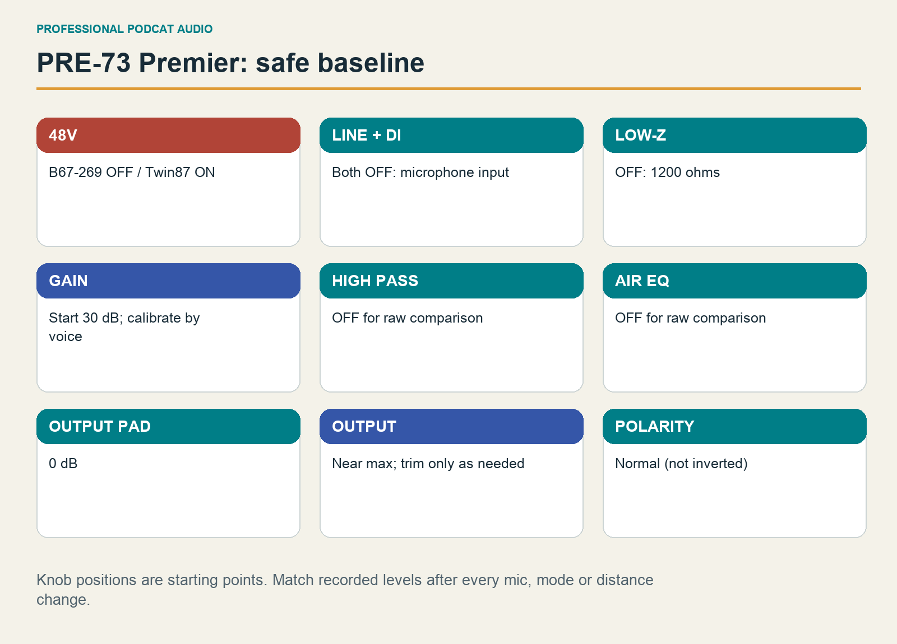

## Every front-panel control

| Control | What to set first | What a later change does |
|---|---|---|
| POWER | On after cabling | Powers the unit from its proper 24 V AC adapter. |
| 48V | B67 off; Twin87 on after cabling | Supplies phantom to the mic input. |
| LINE | Off | Selects the attenuated line-input operating mode. |
| DI | Off; instrument jack unused | Selects the front instrument input. |
| LOW-Z | Off, 1200 Ω | On gives 300 Ω and changes microphone loading. |
| GAIN | 30 dB, then calibrate | Sets mic amplification across the 20–80 dB range. |
| HIGHPASS | Off | Selects 80 or 200 Hz bass roll-off. |
| AIR EQ | Off | Selects +3 or +6 dB high-frequency shaping. |
| OUTPUT PAD | 0 dB | The 14 dB position attenuates after the transformer. |
| OUTPUT | At/near maximum, then trim | Fine adjustment of outgoing level. |
| Ø | Normal polarity | Reverses polarity; mainly useful when combining paths. |

This is the **Premier** control set shown in your photograph. Its high-pass filter has a 6 dB/octave slope; Air is centered around 30 kHz. Other PRE-73 editions have different facilities, so follow this unit's labels. [PRE-73 Premier specifications](https://goldenageaudio.com/outboard-hardware/premier-series-outboard-hardware/pre-73-premier-2/)

The power indicator confirms the unit is on. The output LEDs provide useful warnings, including clipping, but they do not replace the M4 input meter. With the compressor bypassed, perform your loudest expected line. If it clips, reduce PRE gain. If it is comfortably below the intended recording range, increase gain one step and repeat. Ordinary speech peaks around −18 to −12 dBFS are a useful start; keep the loud rehearsal at or below roughly −6 dBFS. Leave room for an unexpected laugh.

A small OUTPUT correction can place a gain step between two useful levels. If the recording sounds rough while its digital peaks look safe, reduce GAIN and restore level with OUTPUT. Distortion may have happened before the converter. Lowering a track fader cannot repair it.

## Rear connections and the hidden termination

The rear combo input receives the microphone lead. Use a main balanced XLR or TRS output to feed COMP-54. Leave the INSERT empty for this workflow: it is an unbalanced internal send/return at a lower operating level, approximately −10 to −18 dBu. It is not interchangeable with the main balanced output.

The internal JP1 jumper controls a 600 Ω output termination. Leave its configuration as supplied or serviced and log it if known. The manual's nominal 14 dB output-pad attenuation depends on this termination being engaged. Do not open the preamp merely to complete the baseline or assume the labeled pad guarantees a measured 14 dB drop in every configuration. [PRE-73 Premier manual, page 2](https://goldenageaudio.com/wp-content/uploads/2026/04/PRE-73-PREMIER-manual.pdf)

## Shape the sound after the reference

If close speech is heavy, compare PRE HPF off against 80 Hz. Try 200 Hz as an audible experiment; it can remove wanted voice body. Compare Air off, +3 and +6 only after checking sibilance. Move the microphone before making a bright setting brighter.

For a deliberate preamp-color experiment, raise GAIN one step and lower OUTPUT enough to preserve the recorded level. Listen for texture as well as distortion. This is a different test from merely making the take louder. Keep a clean reference, and avoid using the output pad or extreme gain to solve a problem caused by excessive input level. Photograph the continuous OUTPUT control and record the measured peak with it.

# Make compression serve the sentence

Compression reduces the difference between stronger and weaker portions of speech. It also makes performance changes, room noise and breaths easier to notice when output level is restored. Begin with the COMP-54's **hard BYPASS engaged** while calibrating the clean microphone/preamp path. Set makeup to **minimum, fully counterclockwise**, before bringing its circuit into use.

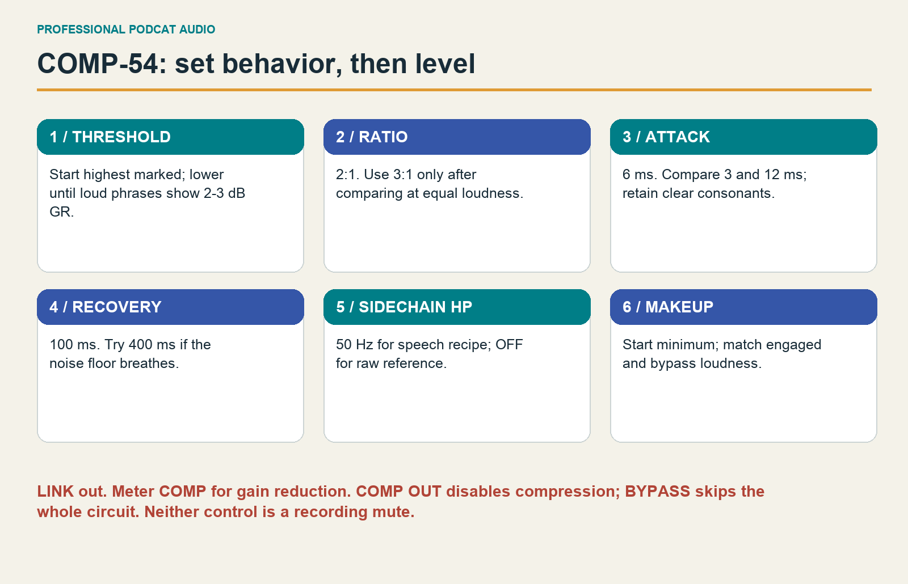

## The six rotary controls

**THRESHOLD** determines when compression begins. Begin at the highest labeled threshold, +10, and lower it while speaking until the gain-reduction meter shows the desired movement. Its analog markings are not DAW dBFS. The same threshold will react differently if mic sensitivity, PRE output or speaking distance changes. Record the final panel position and observed reduction.

**RATIO** sets how strongly above-threshold changes are reduced. Choose 2:1 first. A higher ratio can make the voice steadier but less natural; the effect also depends on threshold. **ATTACK** determines how quickly gain reduction develops. Short settings catch fast events; longer settings let more initial consonant energy through. This compressor is not a guaranteed brick-wall peak limiter.

**RECOVERY** is release: how quickly gain returns after the triggering sound. If gain returns too conspicuously between syllables, background noise can seem to breathe. A longer recovery may smooth that effect, but can also leave the next word quieter. The Auto positions react to program material; they are listening choices rather than fixed times to substitute into a formula.

**SC HP** filters the detector that decides how much to compress. It does **not** remove bass from the recorded signal. At 50 or 100 Hz, low-frequency energy has less influence on reduction. At 7 kHz the detector favors high-frequency events, permitting an experiment in sibilance control. Reduction still changes the full signal; this is not split-band de-essing.

**MAKEUP GAIN** raises the processed output. Start at minimum, then increase only enough to compare the processed and bypassed signal fairly while preserving converter headroom. Your panel has dots rather than a calibrated dB scale, so “two o'clock” cannot guarantee a particular gain.

These functions, stepped controls and separate bypass facilities are described in the [manufacturer's COMP-54 product documentation](https://goldenageaudio.com/outboard-hardware/compressors/comp-54-mkiii/). Your photo does not establish the compressor's revision suffix; its own legends govern the selections below.

## Buttons, meter and rear panel

| Control or connection | Setting for one microphone | How to check it |
|---|---|---|
| POWER | On | Unit operates; use its matching supply. |
| LINK | Off | No second compressor is being linked. |
| OUT / IN-OUT | Compression active after calibration | Stronger phrases move the GR indication. |
| METER | COMP / gain reduction | Read reduction during speech. |
| BYPASS | Off while compressing | On is the hard-bypassed reference. |
| Rear 600 OHM TERM | Normally engaged into modern interface | Follow actual rear label and manual. |
| Rear audio IN | One line-level source from PRE | Do not plug two source outputs into parallel inputs. |
| Rear audio OUT | Balanced line connection to M4 | Recheck M4 peaks after makeup changes. |
| Rear LINK | Unused | A stereo-link facility is not an audio send. |

The compression OUT function retains the audio circuitry while removing compression. Hard BYPASS passes around the entire unit. They answer different questions: how much did compression change the signal, and how much did the whole device change it? Neither is a mute.

The manufacturer's manual gives a factory output-meter reference of about **0 VU = +4 dBu**. Avoid driving the needle repeatedly into its end stop. Use COMP/GR while tracking, and consult the M4 for converter peaks. Leave internal meter trimmers to an appropriate calibration procedure. The original manufacturer-authored [COMP-54 manual is available through this dealer-hosted copy](https://www.adorama.com/col/productManuals/GACOMP54MK2.pdf); the former manufacturer download address was unavailable during research.

## Two recall recipes for either microphone

These are starting behaviors. Select the mic, establish its power and profile, calibrate the clean PRE level, then apply the recipe. They share the same compressor settings across microphones so the comparison has a clear reference. Their final gain, threshold and makeup must be measured separately.

| Parameter | Everyday speech | More dynamic delivery |
|---|---|---|
| Ratio | 2:1 | 3:1 |
| Attack | 6 ms | 12 ms |
| Recovery | 100 ms | 400 ms |
| Sidechain HP | 50 Hz | 100 Hz |
| Threshold | Lower from +10 to about 2–3 dB GR on louder phrases | Lower cautiously; compare occasional 3–4 dB GR on strong phrases |
| Makeup | Minimum, then match reference loudness | Minimum, then match reference loudness |
| Meter / link | COMP / off | COMP / off |
| Hard bypass / compression | Off / active | Off / active |

Record a passage before deciding. If the everyday recipe dulls articulation, compare 12 ms attack. If the longer attack lets troublesome peaks pass, reduce upstream level first and audition a faster attack. If the dynamic recipe makes breaths swell or the room conspicuous, reduce the amount of compression. A polished sentence often needs less reduction than a striking solo demonstration.

## Every stepped compressor experiment

Use these one-control sweeps after saving the reference. Return to the same reference before beginning the next row.

| Control | Complete labeled choices visible on this panel |
|---|---|
| Ratio | 1.5:1, 2:1, 3:1, 4:1, 6:1 |
| Attack | 0.5, 1, 2, 3, 6, 12, 25, 50 ms |
| Recovery | 25, 50, 100, 400, 800 ms; 1.5 s; Auto 1; Auto 2 |
| SC HP | Off, 50 Hz, 100 Hz, 7 kHz |

For threshold, move through the actual detents, noting the marking and reduction; do not assume every dot is a separately printed value. Makeup is continuous: test minimum, matched level and a small measured increase, without clipping. A fixed-threshold sweep reveals what a control changes. A second sweep with threshold reset to the same reduction compares behavior at similar compression strength. Label the two tests separately.

# Read the M4 and listen once

For the main route into rear **LINE IN 3**, the M4's front GAIN 1/2 knobs do not set your recording level. Leave them at minimum if unused, both front 48V buttons off, MON 1/2 off, and the 3–4 direct-monitor button off. The centered mono voice will return through your DAW. Turn INPUT MONITOR MIX toward **PLAYBACK**, then raise the independent headphone level gently.

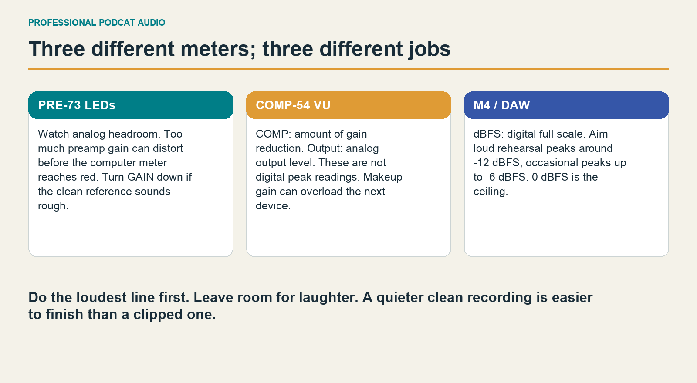

The LCD shows input and output levels. A red overload indication calls for less level before the converter. A blue input-channel marker identifies active hardware monitoring. The large MONITOR knob sets the rear monitor listening level; the smaller headphone knob sets headphone volume. Neither fixes recording gain. INPUT MONITOR MIX changes the balance of direct inputs and computer playback, also without changing the captured input level.

Rear LINE IN 3/4 accepts line level and supplies no phantom. The published maximum input level is +18 dBu; front TRS accepts +16 dBu at minimum gain, while front XLR reaches +10 dBu. These are limits, not recording targets. Rear outputs 1/2 carry the main monitor signal; 3/4 are separate software outputs. RCA outputs mirror their corresponding TRS outputs. MIDI is unused for this voice chain. USB carries audio and powers the M4. [MOTU M Series user guide](https://cdn-data.motu.com/manuals/usb-c-audio/M_Series_User_Guide.pdf)

## Choose one monitoring route

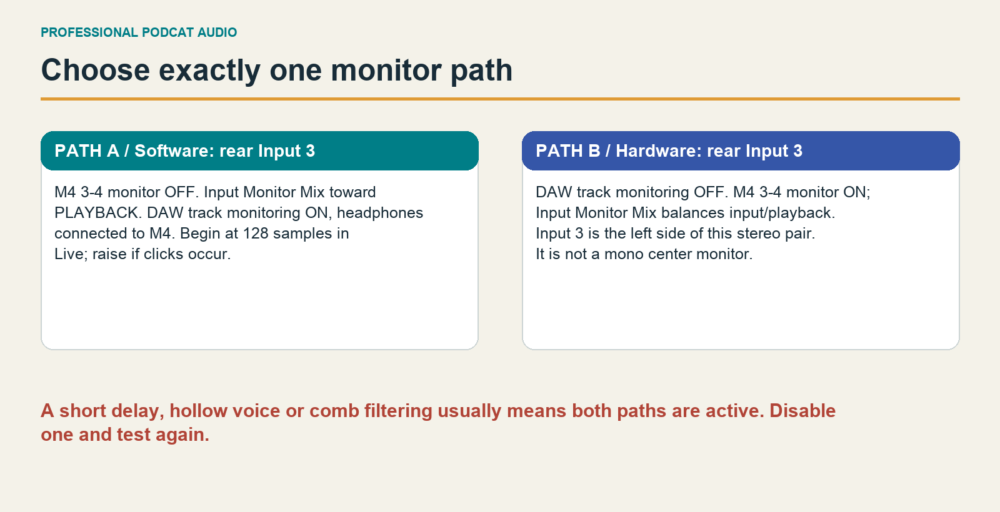

Rear 3–4 direct monitoring operates as a stereo pair; a voice on input 3 alone may be heard only at the left. Selecting a mono DAW track does not change that hardware monitoring path. Keep 3–4 off and use the DAW's centered mono monitor for the main lesson. The [MOTU M4 feature list](https://www.motu.com.pl/motuaudio/m4.html) distinguishes stereo monitoring for rear 3–4 from mono/stereo operation on front 1–2.

For centered direct monitoring, move the balanced COMP output to **front Input 1's TRS connection**, set gain fully counterclockwise and phantom off, choose MON 1's mono operation, and disable DAW input monitoring. Set INPUT MONITOR MIX around center or toward INPUT to hear the direct signal. Select mono Input 1 in the DAW and recalibrate. Front TRS at minimum gain is a useful alternative, not a documented complete bypass of its input amplifier.

Hearing both paths together can produce an echo or hollow tone. Turn off one path before changing EQ. If playback disappears, check the mix knob, DAW output and headphone level. If input meters move but no file is recorded, check track selection and arming. These listening and routing controls can change what you hear without changing the microphone signal at all.


# Your Mac becomes the recorder

This chapter uses the microphone, PRE-73 and COMP-54 settings established in the hardware chapters. The COMP-54 output feeds **MOTU M4 rear line Input 3**, and the M4 connects to the Mac by USB. One microphone is one mono recording channel. Neither a stereo input pair nor a second microphone track improves that recording. The native software recipes below are starting points proposed for this book; they are not manufacturer presets or measurements of your voice.

Software reference date: **29 September 2026**. Apple's current online guide identifies GarageBand 10.4.14. Ableton's manual covers Live 12 across editions, so an illustrated device appearing in that manual does not automatically mean Lite includes it. Interface wording can vary with the installed point release. Match the named function when an older version says Preferences instead of Settings.

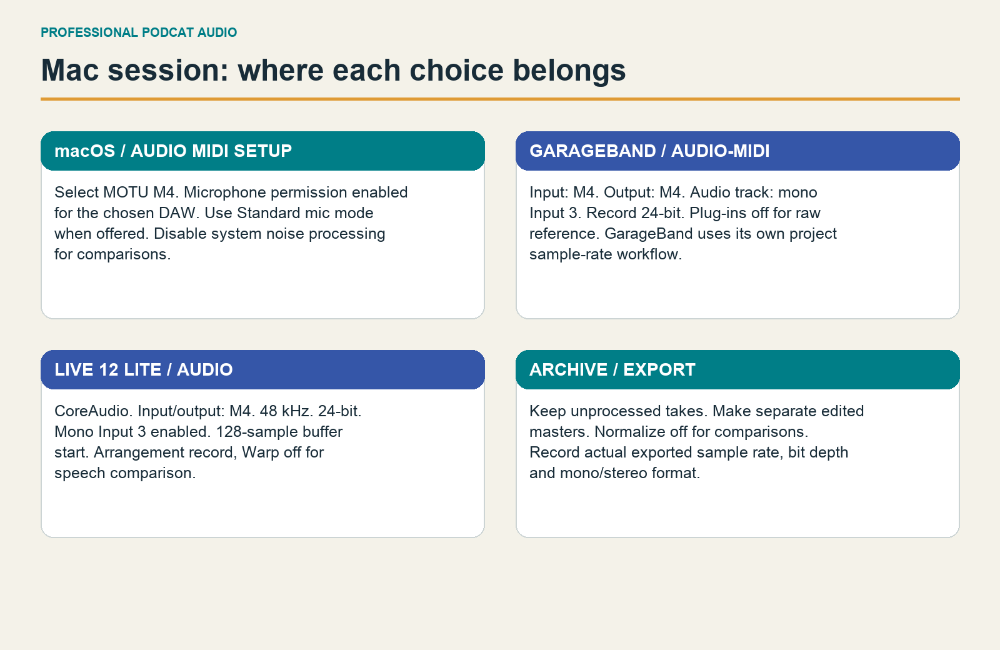

## Prepare macOS before opening a project

1. Connect the M4 directly to the Mac if practical. Connect wired headphones to the M4. Keep loudspeakers off during microphone recording and bring the headphone volume up gradually.
2. Open **System Settings → Privacy & Security → Microphone**. Allow GarageBand and Ableton Live when they request access. A permission called “microphone” also covers the M4's audio inputs. If an application was denied access, quit it, change the permission and reopen it. [Apple: microphone access](https://support.apple.com/guide/mac-help/control-access-to-the-microphone-on-mac-mchla1b1e1fe/mac); [Ableton: microphone access and Mic Mode](https://help.ableton.com/hc/en-us/articles/360001381780-Microphone-access-and-Mic-Mode-on-macOS).
3. While the recording application is using audio input, inspect the macOS microphone menu in the menu bar or Control Center. Select that application and set **Mic Mode: Standard**. Voice Isolation can change external audio as well as the built-in microphone. If no Mic Mode icon is offered, that feature may not apply to the application. [Apple: check Mic Mode](https://support.apple.com/en-us/121587).
4. Open **Applications → Utilities → Audio MIDI Setup**. Choose **Window → Show Audio Devices** if necessary, then select **M4**. Inspect its Format setting and keep the default clock source. Use 44,100 Hz for this book's GarageBand sessions and 48,000 Hz for new Live sessions unless a collaborator requires a different rate. These are workflow choices. The DAW can change the device rate, so inspect it again after opening the project. [Apple: set up audio devices](https://support.apple.com/guide/audio-midi-setup/set-up-audio-devices-ams59f301fda/mac).
5. Close other audio applications during the first test. Use the M4 for both recording input and headphone playback; do not introduce an Aggregate Device for this single-interface setup. Turn on a Focus mode to reduce interruptions.

**GarageBand sample-rate caveat.** GarageBand for Mac does not expose Live's project sample-rate control. Treat this as a 44.1 kHz workflow; setting the M4 to 48 kHz in Audio MIDI Setup is not a reliable way to create a 48 kHz GarageBand project. Inspect a short exported WAVE file before committing to a required delivery rate. On a Mac, the read-only Terminal command `afinfo "/full/path/to/test.wav"` reports the file format. If a production requires controlled 48 kHz recording and export, use Live. Apple's current Mac guide documents input/output and bit-depth settings but does not document a GarageBand project sample-rate selector; do not borrow iPhone documentation as proof of Mac behavior.

## Choose one path for hearing yourself

For this book's rear Input 3 chain, the simple default is **software monitoring**: listen through the DAW with M4 hardware MON buttons off. In GarageBand enable Monitoring for the voice track. In Live use Monitor **Auto** and arm that track. The M4's input/playback mix control must allow the computer playback signal through. A stereo direct-monitor path could otherwise put a single rear input in one ear; software mono input centers the voice.

Rear 3–4 direct monitoring is stereo: Input 3 is heard on the left and Input 4 on the right. For a centered hardware-monitor alternative, connect the COMP-54 to front Input 1 through its TRS line jack, set front gain fully counterclockwise, keep 48V off and use MON 1 in mono mode. Move Input Monitor Mix away from PLAYBACK toward center or INPUT to hear that direct path. Change the DAW source to mono Input 1 and recalibrate. Disable software monitoring: GarageBand Monitoring off, or Live Monitor Off. Recording can still occur with software monitoring off. Do not listen to both paths at once: their different delays can make a voice hollow, doubled or phasey. A track set to Live's **In** monitors continuously and suppresses clip playback, so **Auto** is usually easier for recording followed by listening. [Apple: input monitoring](https://support.apple.com/guide/garageband/turn-on-input-monitoring-for-audio-tracks-gbnd4bc15233/mac); [Ableton: Routing and I/O, Monitoring](https://www.ableton.com/en/manual/routing-and-i-o/#monitoring).

## Establish the recording level

Make a loud rehearsal before the real take. Read your most excited sentence, laugh once and return to normal narration. Use the hardware gain procedure to place normal speech peaks approximately between **−18 and −12 dBFS**, with occasional excited peaks below **−6 dBFS**. These are conservative recording targets, not a required loudness standard. A quiet-looking waveform can be perfectly usable. A waveform with flattened peaks and audible crackle needs investigation.

The track fader controls playback; it does not rescue an overloaded microphone, preamp, compressor input or M4 converter. For rear Input 3, reduce the level arriving from the external chain when the M4 input clips. Twenty-four-bit recording leaves useful headroom. Saving into a 32-bit floating-point file cannot undo analog distortion or clipping that already occurred in the M4 converter.

# GarageBand: a complete spoken-word session

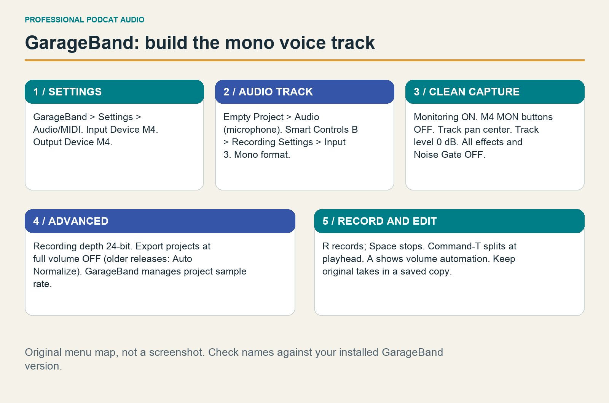

## Build your clean template

1. Choose **File → New → Empty Project**. Create an Audio track for microphone or line input.
2. Open **GarageBand → Settings → Audio/MIDI** and select **M4** for Input Device and Output Device.
3. Select the new track and open **Smart Controls** with **B**. In Recording Settings choose **Input 3**, with the input-format button set to **mono**. If Input 3 is missing, recheck the application's Input Device. A dimmed recording-level control means gain must be set on the external device. [Apple: connect a microphone](https://support.apple.com/guide/garageband/connect-a-microphone-gbnd4f4680f6/mac).
4. Rename the track `B67-269 — CLEAN` or `TWIN87 — CLEAN`. Center its pan and start its volume at 0 dB. Set Monitoring according to the single monitoring path above.
5. In **Settings → Advanced**, choose **24-bit** recording before recording or importing anything. Disable **Export projects at full volume**; older versions may call this **Auto Normalize**. This prevents an export option from undoing deliberate headroom or changing comparison levels. [Apple: Advanced settings](https://support.apple.com/guide/garageband/change-advanced-settings-gbnded6e79bc/mac).
6. Turn off the metronome, count-in and cycle recording for the first narration. Choose a time display if it helps you read minutes and seconds. Tempo and key have no creative role in this unwarped spoken recording.
7. Inspect the Plug-ins area. Bypass the voice patch's effects, disable Noise Gate and set Ambience/Reverb sends to zero. Do the same inspection on the master track. Save as `Podcat — Clean Capture.band`.

**Checkpoint:** speaking moves the M4 Input 3 meter and the intended GarageBand track meter; the voice is centered in the headphones; a recorded test plays back with the intended microphone sound. If tapping near the Mac produces a much louder result than speaking near your microphone, check that M4 is selected instead of the built-in microphone.

## Record and protect the original

Save an episode copy before recording. Put the playhead at the beginning, select the voice track and press **R**. Capture ten seconds of room tone, your name and the setting ID, then the program. Press Space to stop. Play the beginning, a loud passage and the ending. Apple documents recording on the selected audio track from the playhead; record enable controls matter when recording several tracks. [Apple: record audio](https://support.apple.com/guide/garageband/record-to-an-audio-track-gbnd302d468d/mac).

Keep the clean take in a separate saved project before editing. “Clean” here means no software processing; hardware compression already printed into the audio is permanent. For a recoverable microphone test, bypass the COMP-54 during capture. For normal episodes, keep its reduction modest and save its settings photograph.

When a sentence goes wrong, pause, take a quiet breath and restart the whole sentence. A full replacement is usually easier to edit naturally than a replacement syllable. Record one minute of quiet room tone at the end if a fan, traffic or air conditioning might change during the session.

## Edit for natural speech

Select a region, place the playhead at an edit and choose **Edit → Split Regions at Playhead** or press **Command-T**. Split before and after an unwanted phrase, delete that region and move the following material into place. Work from a saved copy; leave enough air around consonants. [Apple: split regions](https://support.apple.com/guide/garageband/split-regions-gbnd76fcce04/mac).

Retain ordinary breaths and short pauses. Remove distractions rather than every human sound. If a cut clicks, move the edit into quieter material and use a short volume ramp. Press **A** to show automation, select Volume and place points around the transition. Four points let you reduce only a breath or mouth noise while preserving the levels on either side. Start with a 3–6 dB reduction; listen in context. Do not automate every breath into digital silence. [Apple: show automation](https://support.apple.com/guide/garageband/show-track-automation-curves-gbnd939b92d8/mac); [Apple: automation points](https://support.apple.com/guide/garageband/add-and-edit-automation-points-gbnd65471e12/mac).

## GarageBand processing card

Work on an edited copy. Open Smart Controls, expand Plug-ins and insert **Channel EQ**, then **Compressor**. Click a plug-in slot to open its controls; its power button enables a meaningful bypass comparison. Preserve the original track before applying changes. [Apple: effect plug-ins](https://support.apple.com/guide/garageband/add-and-edit-effect-plug-ins-gbndac55f7f8/mac).

| Control | B67-269 starting value | Twin87 starting value |
|---|---|---|
| EQ high-pass | 70 Hz, 12 dB/octave, Q about 0.71; off if PRE high-pass suffices | 70 Hz, 12 dB/octave, Q about 0.71; off if PRE high-pass suffices |
| EQ low shelf | Off | Off |
| EQ bell at 250 Hz | 0 dB, Q 1.0 | 0 dB, Q 1.0 |
| EQ bell at 3 kHz | 0 dB, Q 0.7 | 0 dB, Q 0.7 |
| EQ high shelf / low-pass | Off / off | Off / off |
| Other EQ bands | Off; EQ output 0 dB | Off; EQ output 0 dB |
| Compressor Threshold | Begin −18 dB; adjust to the actual take | Begin −18 dB; adjust to the actual take |
| Compressor Ratio | 2:1 | 2:1 |
| Compressor Attack | 20 ms | 20 ms |
| Compressor Gain | 0 dB initially; match bypass loudness | 0 dB initially; match bypass loudness |
| Noise Gate, reverb, echo | Off | Off |

Select EQ bands using the colored symbols, then edit frequency, gain/slope and Q in the numeric fields. The neutral bells are preparation, not mandatory boosts or cuts. The GarageBand compressor's simplified window may expose only Threshold, Ratio, Attack and Gain; do not search for Live's release, knee and sidechain controls there. [Apple: EQ controls](https://support.apple.com/guide/garageband/use-the-eq-effect-gbnd56ab9fca/mac).

The identical starting values are deliberate. A microphone name cannot determine the right EQ for an unknown voice and room. After matching levels, try a **−2 dB cut near 250 Hz** only if that take is muddy. Try **−1 to −2 dB in the high range** only if it is persistently sharp. Change placement before forcing a large EQ correction. For isolated sibilants, lower those short passages with automation; a static treble cut also dulls vowels and is not a selective de-esser.

If hardware compression already controls the take, leave the software Compressor bypassed first. If extra control helps, lower its threshold gradually while listening for steady sentences, intact consonants and quiet breaths. Match bypassed and processed loudness with Gain before judging. Stop when processing makes words less lively or the room noise noticeably swells.

## Export a GarageBand master

Save the final project. Set the intended region/cycle range, choose **Share → Export Song to Disk**, select **WAVE** and **24-bit uncompressed** when offered. Export the intended range, not an accidental empty tail. GarageBand exports stereo; a mono voice centered in that export is expected. Keep automatic full-volume export disabled. Listen to the exported file from start to finish. [Apple: export songs](https://support.apple.com/guide/garageband/export-songs-to-disk-or-icloud-gbnd7cbf5ed9/mac).

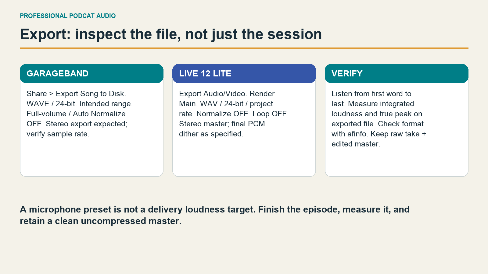

Call this file `episode-001_edit-master.wav`. A clean, balanced export with headroom is a valuable deliverable even before loudness finishing. To use the book's fully specified final limiter, import this master into Live, disable Warp and follow the finishing procedure below. Do not recompress an already controlled voice just because the second DAW offers another compressor.

# Ableton Live 12 Lite: precise capture and finishing

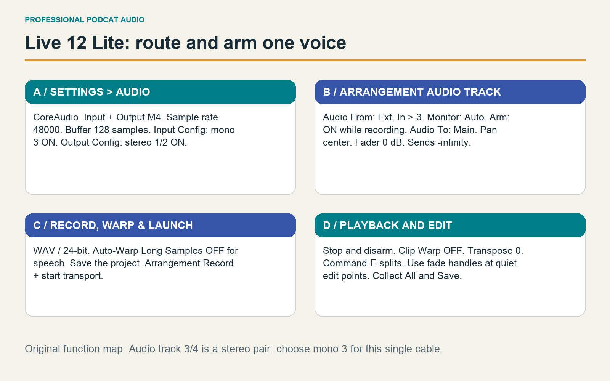

## Configure the project

Lite supports eight audio/MIDI tracks and eight mono input channels. This session needs only one microphone track and, optionally, a second comparison track. The recipe uses **Channel EQ, Compressor and Limiter**, which the official Lite comparison includes. **EQ Eight and Gate are not included in Lite.** [Ableton: edition comparison including Lite](https://www.ableton.com/en/upgrade-live/).

Open **Live → Settings → Audio**. Set the following before recording:

| Setting | Value for this chain |
|---|---|
| Driver Type | CoreAudio |
| Audio Input Device / Output Device | M4 / M4 |
| In/Out Sample Rate | 48,000 Hz for new Live sessions; 44,100 Hz for direct GarageBand comparison |
| Input Config | Enable mono 3; enable other inputs only when used |
| Output Config | Enable stereo 1/2 |
| Buffer Size | Start 128 samples for software monitoring; try 256 if it crackles |
| Driver Error Compensation | Leave default unless actually measured |
| Test Tone | Off before speaking |

The buffer is a latency/stability tradeoff, not a quality setting. At 48 kHz, 128 samples represents about 2.7 ms per buffer; actual round-trip latency includes additional input, output and processing delays. If a stable buffer feels too slow, simplify the monitored chain. For supported hardware direct monitoring, 256 or 512 samples can be comfortable because that listening path bypasses the DAW. [Ableton: interface setup](https://help.ableton.com/hc/en-us/articles/211476789-Setting-up-an-Audio-Interface).

In **Settings → Record, Warp & Launch**, select WAV and 24-bit recording. Turn **Auto-Warp Long Samples** off for spoken-word imports. Leave Create Fades on Clip Edges on. Save a new project before the take so the recording has a clear home. [Ableton: recording file types](https://www.ableton.com/en/manual/recording-new-clips/#setting-up-file-types).

Switch to **Arrangement View** with Tab. Insert an audio track, name it for the microphone and set **Audio From: Ext. In → 3**. Set Monitor **Auto** for software monitoring, arm the track and route **Audio To: Main**. Set pan center, track volume 0 dB, sends to minus infinity and Main volume 0 dB. Remove unneeded template effects and turn off the metronome. Mono 3 records a mono file; 3/4 records a pair and is wrong for this one-cable chain. [Ableton: external audio routing](https://www.ableton.com/en/manual/routing-and-i-o/#external-audio-inout).

## Capture, edit and save

Click Arrangement Record and start the transport. Capture room tone, setting ID and speech. Stop, disarm and listen back. Duplicate the Set before editing. Check each narration clip's **Warp: Off**, **Transpose: 0** and clip gain before comparing versions. Imported music can follow its own needs; speech should keep its original timing and pitch.

Expand the audio track so its waveform is readable. Select an unwanted time range and split at its boundaries with **Command-E**. Remove the mistake and close the gap by moving the following material. With automation hidden, reveal the small fade handles at clip edges. Use short fades around edits and longer crossfades only where they sound natural. Adjacent clips support crossfades; a default tiny fade avoids many clicks. [Ableton: Arrangement editing and fades](https://www.ableton.com/en/manual/arrangement-view/#audio-clip-fades-and-crossfades).

Reduce loud breaths or individual consonants with clip gain or volume automation. Rehearse the edit at normal listening level, then quietly: an edit that seems smooth only at high volume may still interrupt a sentence. Preserve a clean Set and use **Collect All and Save** when moving the project to another drive so referenced audio travels with it.

## Lite processing and final limiter cards

Add these devices in order. These author-proposed settings apply to either microphone; save independent copies once the listening test establishes a useful difference.

| Device/control | Starting setting |
|---|---|
| Channel EQ HP 80 Hz | On if PRE high-pass is off; audition off if a low voice becomes thin |
| Channel EQ Low / Mid / High | 0 / 0 / 0 dB |
| Channel EQ Mid frequency / Output | 250 Hz / 0 dB |
| Compressor Mode / envelope | RMS / Log |
| Compressor Threshold / Ratio | −18 dB starting threshold / 2:1 |
| Compressor Attack / Release | 20 ms / 120 ms; Auto Release off |
| Compressor Knee / Lookahead | 6 dB / 0 ms |
| Compressor Makeup / Out / Dry-Wet | Off / 0 dB initially / 100% |
| Compressor external sidechain / detector EQ | Off / off |
| Main Limiter Ceiling / ceiling mode | −1.5 dB / True Peak, if present |
| Limiter Input Gain / Maximize | 0 dB initially / off |
| Limiter Release / Auto | 100 ms if manual / Auto on |
| Limiter Lookahead / Routing / Link | 3 ms / L-R / 100% |
| Main fader / devices after Limiter | 0 dB / none |

Channel EQ has a fixed 80 Hz high-pass and a sweepable mid band. Compressor's threshold must be adjusted against the actual recording; aim initially for only 1–3 dB additional reduction on louder words, especially after the COMP-54. Current Limiter offers True Peak, while older Live 12 versions may have fewer controls. If True Peak or another listed control is absent, use the available controls, keep at least 2 dB sample-peak headroom and verify true peaks in the rendered file. [Ableton: Audio Effect Reference, Channel EQ, Compressor and Limiter](https://www.ableton.com/en/manual/live-audio-effect-reference/).

Raise level before the final Limiter only after balancing sentences. If it frequently removes more than about 3 dB, fix the loud phrases or ease the target instead of flattening the whole episode. Bypass comparisons need matched loudness. Louder nearly always sounds more exciting on a quick comparison.

## Export and verify the delivery file

Select the finished time range. Choose **File → Export Audio/Video** or **Command-Shift-R**. Render **Main**; choose WAV, 24-bit and the project sample rate. Set **Normalize off** and **Render as Loop off**. Keep Convert to Mono off for a stereo master. For a final 24-bit PCM render, Triangular dither is a reasonable choice; use 32-bit with no dither if further mastering is planned. Live's optional MP3 export is fixed at 320 kbps, so use an encoder or hosting service when a different delivery bitrate is required. [Ableton: exporting audio](https://www.ableton.com/en/manual/managing-files-and-sets/#exporting-audio-and-video).

Measure the exported file, because a limiter ceiling is not a loudness meter. Apple recommends about **−16 LKFS, ±1 dB**, with true peak at or below **−1 dBFS**; this book leaves extra peak margin at −1.5 dBTP. A common mono convention of −19 LUFS is not Apple's blanket requirement. Follow your destination's current specification and label mono versus stereo clearly. [Apple Podcasts: audio requirements](https://podcasters.apple.com/support/893-audio-requirements).

If FFmpeg is installed, this read-only analysis produces an integrated-loudness and true-peak summary without changing the audio:

```sh
ffmpeg -hide_banner -i "episode-001_master.wav" \
  -af "ebur128=peak=true" -f null -
```

Read the final Integrated loudness `I` and True peak summary. Keep the same channel layout and measurement method for every comparison. If the final stereo file measures −19 LUFS and peaks have room, try approximately 3 dB more gain before the limiter, export and measure again. This arithmetic is a starting estimate; limiting changes the result. [FFmpeg: ebur128 scanner](https://ffmpeg.org/ffmpeg-filters.html#ebur128).

Listen to the encoded delivery file too, using headphones and an ordinary small speaker. Check the first word, last word, edit joins, room noise and loudest laugh. Keep the DAW project, clean recording, edited WAV and delivered file as separate named artifacts.

# Compare the microphones without fooling yourself

## Two different questions require two tests

**The controlled test** asks what changes when the microphone or one setting changes. **The finished-voice test** asks which complete setup produces the episode you prefer. Keep separate results. A heavily processed Twin87 versus a clean B67-269 can be a useful finished-chain comparison, but cannot identify the microphone alone as the cause.

Use one microphone at a time through the same cable path, preamp, compressor and rear M4 input. Two microphones side by side do not occupy the same acoustic position, and one external channel cannot provide identical simultaneous processing to both. Mark the capsule position, chair position and pop-filter distance; allow each microphone its appropriate power and warm-up procedure from the hardware chapter. Never hurry a powered mic swap to preserve test timing.

Record this original test script at a natural pace:

> Welcome to Professional Podcat Audio. Today we are comparing a calm voice, a clear explanation and a brighter announcement. Peter packed a paper parcel. Six soft sentences should stay smooth. Now I will speak quietly, then return to my usual level. This next sentence is more excited, but I will keep the same distance. One, two, three. And now, ten seconds of room tone.

Use three takes per condition. Speech changes between performances; repeated takes help reveal whether the difference survives normal variation. If you need an exactly repeatable sound for a technical check, replay a recorded voice through one fixed loudspeaker. Label that as a loudspeaker test: its sound and room interaction differ from a live speaker.

## Work through a controlled sequence

| Test | Change | Hold steady |
|---|---|---|
| 01 Reference | B67-269 versus Twin87 | Cardioid, same capsule position, COMP-54 bypassed, DAW effects off |
| 02 Placement | 15, 20 and 30 cm mouth-to-capsule distance | Mic mode, angle and gain; assess raw difference, then level-match copies |
| 03 Angle | Straight on, 15°, 30° off axis | Distance, mic position and hardware settings |
| 04 Mic voicing | Available B67-269 voicings or Twin87 Vintage/Modern | Pattern, distance, chain; follow mic switching procedure |
| 05 Pattern | Cardioid versus another pattern | Voice position and room; rear sound pickup is part of this test |
| 06 PRE-73 | One impedance or gain/output comparison | Mic, position, compressor bypass, matched recording peaks |
| 07 COMP-54 | Bypass versus gentle compression | Same mic and preamp; match output level for listening |
| 08 DAW processing | Clean versus one EQ or compression change | Use a duplicate of the exact same recorded take |
| 09 Finished chain | Best repeatable setup for each microphone | Same script, delivery loudness, listening level and export format |

Do not test every combination at once. Finish placement first, then voicing, then compression. An apparent need for severe processing often disappears after a small positioning change. Each test ends with a saved decision: keep, reject or repeat.

## Match listening level, then hide the names

For microphone preference, adjust the PRE-73 separately for each mic to obtain similar safe recording peaks. Identical gain-knob positions are not a fairness requirement because microphone sensitivity can differ. A separate fixed-gain test can document sensitivity; label it accordingly and still match playback levels before judging tone.

Export equal spoken passages with effects bypassed and normalization off. Measure both in the same channel layout, then turn the louder file down by the loudness difference. For example, A at −22 LUFS and B at −19.5 LUFS calls for approximately **−2.5 dB on B**. Do not peak-normalize as a substitute: equal highest peaks can still leave different average loudness. Keep the matched copies under clipping and leave raw files untouched.

Put A and B on separate tracks with identical output routing. In GarageBand use track Volume; in Live use clip gain or track Volume. Solo one at a time, never sum both. Have someone assign neutral file names if possible; otherwise conceal the track labels while listening. Score warmth, intelligibility, sibilance, plosives, room pickup and fatigue from 1–5. Also write one plain sentence: “I can follow quiet words more easily,” for example, is more actionable than “better.”

Finish with two saved recall sheets. Each must include mic/model and voicing, polar pattern, pad/filter state, distance/angle, PRE-73 gain/output/impedance, COMP-54 settings and observed reduction, M4 input, DAW version, sample rate, every enabled plug-in value, export layout and measured loudness. Save one final **B67-269** template and one final **Twin87** template. Your own verified settings now replace the book's starting values.


# Six microphone-and-chain recall cards

These cards join the microphone-specific power and mode settings to three shared toolchain recipes. Complete the gain calibration every time you change mic, mode, distance or delivery. The suggested starting values are identical where no measurement justifies a difference. Save the final calibrated versions separately for each mic.

## BeesNeez B67-269: mic settings for all three cards


| Control | Set / verify |
|---|---|
| Power | Matching BeesNeez PSU ON; PRE-73 48V OFF; M4 48V OFF |
| Mode | As found / internal mode unverified; 67 Vintage; 67 New; 269 Vintage; 269 New |
| Pattern | Cardioid at PSU |
| Pad | As found; OFF only if documented/verified |
| Filter | As found; HPF OFF and S2 OFF only if verified |
| Other internal state | Sound profile as found; do not assume a factory state |

The four named profiles require internal switches. Use As found until your exact revision and safe unpowered handling procedure are confirmed by BeesNeez. This selection records a known state; it never authorizes opening or live-switching the microphone.

### BEES / 01 / Raw reference

Learn the sound of the mic and room. All processing off; match recorded levels for the comparison.

**Placement:** 20 cm mouth-to-capsule; 15-30 degrees off axis; pop filter.

**PRE-73 Premier**

| Control | Set / verify |
|---|---|
| GAIN | 30 dB start; calibrate loud peaks near -12 dBFS |
| OUTPUT | At/near maximum for clean low-drive start; trim only as needed |
| HIGH PASS | OFF |
| AIR EQ | OFF |
| OUTPUT PAD | 0 dB |
| LOW-Z | OFF / 1200 ohms |
| LINE | OFF |
| DI | OFF |
| POLARITY | Normal |
| POWER | ON |
| 48V | OFF; BeesNeez uses its matching PSU |

**COMP-54**

| Control | Set / verify |
|---|---|
| POWER | ON |
| BYPASS | ON / hard bypass |
| COMP | OUT |
| THRESHOLD | Highest marked threshold parked; inactive in bypass |
| RATIO | 2:1 parked |
| ATTACK | 6 ms parked |
| RECOVERY | 100 ms parked |
| SC HP | OFF |
| MAKEUP GAIN | Minimum parked; no calibrated dB scale |
| METER | COMP / gain reduction |
| LINK | OUT / unlinked |
| REAR 600 OHM TERM | Engaged if present, per matching manual; record actual state |

**DAW:** All track and master processing OFF. Track fader 0 dB; pan center. Normalize OFF. Use the selected DAW card below; keep a separate saved session for this microphone.

### BEES / 02 / Everyday spoken voice

A gentle analog starting point after the raw reference passes. Preserve natural consonants.

**Placement:** 15-20 cm mouth-to-capsule; 15-30 degrees off axis; pop filter.

**PRE-73 Premier**

| Control | Set / verify |
|---|---|
| GAIN | 30 dB start; recalibrate before compression |
| OUTPUT | At/near maximum initially; trim to target |
| HIGH PASS | 80 Hz; compare with OFF for low voices |
| AIR EQ | OFF |
| OUTPUT PAD | 0 dB |
| LOW-Z | OFF / 1200 ohms |
| LINE | OFF |
| DI | OFF |
| POLARITY | Normal |
| POWER | ON |
| 48V | OFF; BeesNeez uses its matching PSU |

**COMP-54**

| Control | Set / verify |
|---|---|
| POWER | ON |
| BYPASS | OFF / circuit active |
| COMP | IN |
| THRESHOLD | Start highest marked threshold; lower to 2-3 dB gain reduction on loud phrases |
| RATIO | 2:1 |
| ATTACK | 6 ms |
| RECOVERY | 100 ms |
| SC HP | 50 Hz |
| MAKEUP GAIN | Minimum initially; raise to loudness-match bypass, then verify digital peaks |
| METER | COMP / gain reduction |
| LINK | OUT / unlinked |
| REAR 600 OHM TERM | Engaged if present, per matching manual; record actual state |

**DAW:** Start with EQ flat and software compressor OFF. Use the optional DAW finishing settings only after listening. Use the selected DAW card below; keep a separate saved session for this microphone.

### BEES / 03 / Expressive voice

More distance and restrained compression for emphatic delivery. Still rehearse your loudest line.

**Placement:** 25 cm mouth-to-capsule; 20-30 degrees off axis; pop filter.

**PRE-73 Premier**

| Control | Set / verify |
|---|---|
| GAIN | 30 dB start; recalibrate at the new distance |
| OUTPUT | At/near maximum initially; trim to target |
| HIGH PASS | 80 Hz; compare OFF if voice thins |
| AIR EQ | OFF |
| OUTPUT PAD | 0 dB |
| LOW-Z | OFF / 1200 ohms |
| LINE | OFF |
| DI | OFF |
| POLARITY | Normal |
| POWER | ON |
| 48V | OFF; BeesNeez uses its matching PSU |

**COMP-54**

| Control | Set / verify |
|---|---|
| POWER | ON |
| BYPASS | OFF / circuit active |
| COMP | IN |
| THRESHOLD | Start highest marked threshold; lower to 3-4 dB gain reduction on emphatic phrases |
| RATIO | 3:1 |
| ATTACK | 12 ms |
| RECOVERY | 400 ms; listen for slow recovery |
| SC HP | 100 Hz; compare 50 Hz if plosives escape |
| MAKEUP GAIN | Minimum initially; raise to loudness-match bypass, then verify digital peaks |
| METER | COMP / gain reduction |
| LINK | OUT / unlinked |
| REAR 600 OHM TERM | Engaged if present, per matching manual; record actual state |

**DAW:** Software compressor OFF initially. Edit peaks manually; optional final limiter is delivery protection, not input protection. Use the selected DAW card below; keep a separate saved session for this microphone.

## United Studio Technologies UT Twin87: mic settings for all three cards


| Control | Set / verify |
|---|---|
| Power | PRE-73 48V ON after XLR connected; M4 48V OFF |
| Mode | Vintage; Modern |
| Pattern | Cardioid |
| Pad | OFF |
| Filter | OFF |
| Other internal state | Internal RF-filter group as found; factory bypass per manual; do not change for routine setup |

Switch front Vintage/Modern selector; mute monitoring, wait about 10 seconds, then recalibrate. Modern output is hotter.

### TWIN / 01 / Raw reference

Learn the sound of the mic and room. All processing off; match recorded levels for the comparison.

**Placement:** 20 cm mouth-to-capsule; 15-30 degrees off axis; pop filter.

**PRE-73 Premier**

| Control | Set / verify |
|---|---|
| GAIN | 30 dB start; calibrate loud peaks near -12 dBFS |
| OUTPUT | At/near maximum for clean low-drive start; trim only as needed |
| HIGH PASS | OFF |
| AIR EQ | OFF |
| OUTPUT PAD | 0 dB |
| LOW-Z | OFF / 1200 ohms |
| LINE | OFF |
| DI | OFF |
| POLARITY | Normal |
| POWER | ON |
| 48V | ON after XLR is connected |

**COMP-54**

| Control | Set / verify |
|---|---|
| POWER | ON |
| BYPASS | ON / hard bypass |
| COMP | OUT |
| THRESHOLD | Highest marked threshold parked; inactive in bypass |
| RATIO | 2:1 parked |
| ATTACK | 6 ms parked |
| RECOVERY | 100 ms parked |
| SC HP | OFF |
| MAKEUP GAIN | Minimum parked; no calibrated dB scale |
| METER | COMP / gain reduction |
| LINK | OUT / unlinked |
| REAR 600 OHM TERM | Engaged if present, per matching manual; record actual state |

**DAW:** All track and master processing OFF. Track fader 0 dB; pan center. Normalize OFF. Use the selected DAW card below; keep a separate saved session for this microphone.

### TWIN / 02 / Everyday spoken voice

A gentle analog starting point after the raw reference passes. Preserve natural consonants.

**Placement:** 15-20 cm mouth-to-capsule; 15-30 degrees off axis; pop filter.

**PRE-73 Premier**

| Control | Set / verify |
|---|---|
| GAIN | 30 dB start; recalibrate before compression |
| OUTPUT | At/near maximum initially; trim to target |
| HIGH PASS | 80 Hz; compare with OFF for low voices |
| AIR EQ | OFF |
| OUTPUT PAD | 0 dB |
| LOW-Z | OFF / 1200 ohms |
| LINE | OFF |
| DI | OFF |
| POLARITY | Normal |
| POWER | ON |
| 48V | ON after XLR is connected |

**COMP-54**

| Control | Set / verify |
|---|---|
| POWER | ON |
| BYPASS | OFF / circuit active |
| COMP | IN |
| THRESHOLD | Start highest marked threshold; lower to 2-3 dB gain reduction on loud phrases |
| RATIO | 2:1 |
| ATTACK | 6 ms |
| RECOVERY | 100 ms |
| SC HP | 50 Hz |
| MAKEUP GAIN | Minimum initially; raise to loudness-match bypass, then verify digital peaks |
| METER | COMP / gain reduction |
| LINK | OUT / unlinked |
| REAR 600 OHM TERM | Engaged if present, per matching manual; record actual state |

**DAW:** Start with EQ flat and software compressor OFF. Use the optional DAW finishing settings only after listening. Use the selected DAW card below; keep a separate saved session for this microphone.

### TWIN / 03 / Expressive voice

More distance and restrained compression for emphatic delivery. Still rehearse your loudest line.

**Placement:** 25 cm mouth-to-capsule; 20-30 degrees off axis; pop filter.

**PRE-73 Premier**

| Control | Set / verify |
|---|---|
| GAIN | 30 dB start; recalibrate at the new distance |
| OUTPUT | At/near maximum initially; trim to target |
| HIGH PASS | 80 Hz; compare OFF if voice thins |
| AIR EQ | OFF |
| OUTPUT PAD | 0 dB |
| LOW-Z | OFF / 1200 ohms |
| LINE | OFF |
| DI | OFF |
| POLARITY | Normal |
| POWER | ON |
| 48V | ON after XLR is connected |

**COMP-54**

| Control | Set / verify |
|---|---|
| POWER | ON |
| BYPASS | OFF / circuit active |
| COMP | IN |
| THRESHOLD | Start highest marked threshold; lower to 3-4 dB gain reduction on emphatic phrases |
| RATIO | 3:1 |
| ATTACK | 12 ms |
| RECOVERY | 400 ms; listen for slow recovery |
| SC HP | 100 Hz; compare 50 Hz if plosives escape |
| MAKEUP GAIN | Minimum initially; raise to loudness-match bypass, then verify digital peaks |
| METER | COMP / gain reduction |
| LINK | OUT / unlinked |
| REAR 600 OHM TERM | Engaged if present, per matching manual; record actual state |

**DAW:** Software compressor OFF initially. Edit peaks manually; optional final limiter is delivery protection, not input protection. Use the selected DAW card below; keep a separate saved session for this microphone.

## M4 settings for every card

| Control | Set / verify |
|---|---|
| CABLE | COMP balanced main output → rear LINE IN 3, balanced TRS |
| INPUT 1 GAIN | Fully counterclockwise / unused |
| INPUT 2 GAIN | Fully counterclockwise / unused |
| 48V 1 + 2 | OFF |
| MON 1 + 2 | OFF |
| MON 3-4 | OFF (software monitoring route) |
| INPUT MONITOR MIX | PLAYBACK side |
| MONITOR VOLUME | Down during setup; speakers muted while recording |
| HEADPHONES | Start down, raise to comfortable level |
| USB / POWER | Connected to Mac; interface on |

## GarageBand for Mac settings for every card

| Control | Set / verify |
|---|---|
| Audio input/output | MOTU M4 / MOTU M4 |
| Track | Audio microphone track; mono Input 3 |
| Monitoring | ON for software path; headphones only |
| Recording depth | 24-bit, Settings > Advanced |
| Sample rate | GarageBand-managed; verify export, normally 44.1 kHz |
| Track fader / pan | 0 dB / center |
| Track / master effects | OFF for raw comparison |
| Metronome / count-in | OFF |
| Noise Gate | OFF |
| Export | WAV or AIFF; 24-bit; export at full volume/auto-normalize OFF |


Optional: Channel EQ high-pass 70 Hz, 12 dB/oct if available (OFF if PRE HP already sufficient); 250 Hz -2 dB Q1 only if muddy; other bands 0. Compressor only if needed: threshold -18 dB, ratio 2:1, attack 20 ms, gain 0 dB; lower threshold gradually for gentle control and level-match bypass. Reverb/echo/gate OFF. No claim of LUFS or true-peak verification from the GarageBand meter.

## Ableton Live 12 Lite settings for every card

| Control | Set / verify |
|---|---|
| Driver / device | CoreAudio / MOTU M4 input and output |
| Sample rate / depth | 48 kHz / 24-bit |
| Buffer | 128 samples start; 256 if clicks |
| Input Config | Enable mono 3 |
| Track | Audio From Ext. In > 3; mono |
| Monitor | Auto with track armed for rehearsal/record; disarm for playback |
| Audio To | Main; Main Out 1/2 |
| Track fader / pan | 0 dB / center |
| Warp / effects | Warp OFF; all effects OFF for raw comparison |
| Metronome / loop / sends | OFF / OFF / sends -inf |
| Export | WAV PCM, 48 kHz, 24-bit; Normalize OFF; Triangular dither for final PCM; Convert to Mono OFF for stereo master (use mono only when required) |


Optional: Channel EQ low/mid/high 0 dB, mid frequency 250 Hz, output 0 dB; HP80 off if PRE HP sufficient, otherwise on. Compressor only if needed: -18 dB threshold, 2:1 ratio, attack20 ms, release120 ms, Auto release OFF, RMS/Log, 6 dB knee, makeup OFF, lookahead0 ms, Out0 dB, Dry/Wet100%, external sidechain/detector EQ OFF; adjust to 1-3 dB GR. Current Limiter: ceiling mode True Peak, ceiling -1.5 dB, input gain0, Maximize OFF, Auto release ON, lookahead3 ms, L/R, Link100%; Main fader0 dB, no devices after Limiter. Measure exported file; use available controls and -2 dB sample-peak headroom if older limiter lacks True Peak.

## Write your calibrated recall

Record the take filename, PRE gain detent and OUTPUT mark, COMP threshold mark and MAKEUP mark, observed loudest input peak, usual and maximum gain reduction, actual DAW plug-in settings, output channel layout, LUFS and true peak. A suggested recipe becomes your preset only after this record is complete.


# A laboratory you can run at your desk

The comparison chapter explains a fair audition. This chapter turns that method into a complete test plan. You do not need to record every possible combination. You need a baseline, a clearly named variable, a repeatable passage and a decision. Keep the factory manuals beside this book when checking an unfamiliar switch.

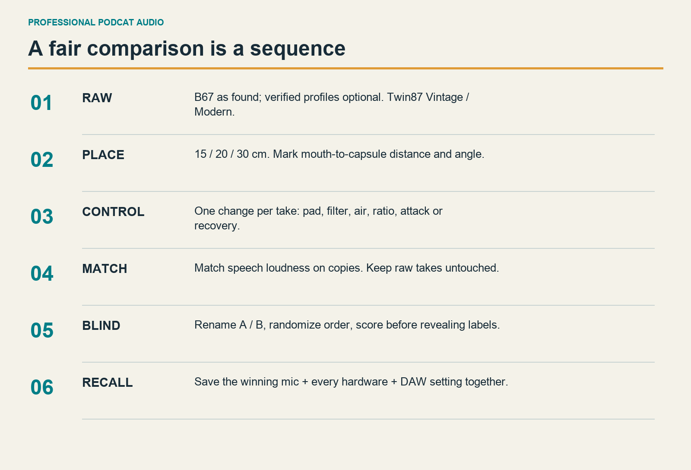

## The baseline and six named microphone profiles

Start with **B-ASFOUND** and **T-VINTAGE**. Record three takes of each, alternating microphone order when time allows. Add **T-MODERN** after the documented settling time and recalibrate. If the manufacturer has confirmed your unit's safe internal handling procedure, add the four BeesNeez states: **B-67-VINTAGE**, **B-67-NEW**, **B-269-VINTAGE**, **B-269-NEW**. Do not infer a hidden switch from the sound of a recording. Unknown settings stay “unknown” in the log.

For each profile, use the raw recipe: cardioid, COMP hard bypass, PRE high-pass and Air off, M4 rear Input 3, no DAW processing. A BeesNeez with unknown internal filters remains an **as-found system comparison**, not a proof that its bare capsule or circuit is flat. The other microphone's raw take is still useful; the label states the limit.

Record the same script and room tone. Write the actual PRE gain and output, input peak, capsule distance and microphone state for every file. Rename each audio file before moving on. An example is `2026-09-29_T-MODERN_raw_20cm_take02.wav`. Use simple filenames so exports, backups and the vault can all refer to the same take.

## Test every control without testing every combination

The accompanying `control-sweeps.csv` names the controls, candidate positions, prerequisites and listening question. It covers the user controls of both mics and the shared chain. Continuous controls such as output level and makeup gain have infinitely many possible positions, so test defined reference points and write the actual mark. Do not claim a finite preset matrix exhausts them.

Use this five-part method for each sweep:

1. Recall the clean reference and record ten seconds of it.
2. Change exactly one selected control. For a discrete control, use the next printed position. For a continuous control, choose a clearly measurable target such as matched bypass loudness. For the stepped threshold, choose the nearest detent producing 1, 3 or 6 dB indicated gain reduction.
3. Record the same passage. Note peak level and any audible overload.
4. Return to the reference and record it again. This A/B/A pattern helps expose changing performance or room noise.
5. Loudness-match listening copies, score blind if possible, and write “keep,” “reject,” or “repeat.”

There are two valid compressor experiments. In a **fixed-threshold sweep**, leave threshold and makeup unchanged as you change ratio, attack or recovery; this shows how the control changes level and envelope. In an **equal-reduction sweep**, reset threshold to produce the same approximate reduction and then match output loudness; this better isolates the audible envelope. Name the experiment in the log. Mixing their conclusions is misleading.

## A manageable order for the full sweep

| Pass | Conditions | What to listen for |
|---|---|---|
| Placement | 15, 20, 30 cm; then 0, 15, 30 degrees | Plosives, proximity bass, room sound, consistency |
| Mic identity | Bees as found; Twin Vintage/Modern; verified Bees profiles later | Intelligibility and fatigue after loudness matching |
| Polar pattern | Cardioid first; omni and figure-eight; Bees intermediate positions if needed | Room pickup and rear sensitivity, not just bass |
| Microphone pad | Off versus -10 dB, then level-match | Actual microphone overload; unnecessary attenuation adds gain demand |
| Mic LF filters | Each available filter separately, only when accessible through verified procedure | Rumble versus lost voice body |
| PRE high-pass | Off, 80 Hz, 200 Hz | Plosive/desk rumble versus thin voice |
| PRE Air | Off, +3, +6 dB | Subjective openness versus hiss/sharpness; no assumed benefit |
| PRE impedance | Twin87 at 1200/300 ohms; Bees stays 1200 baseline | Tone and level change; recheck gain |
| PRE gain/output | Clean low-gain/high-output versus one gain step up/output reduced | Coloration at equal loudness and safe peaks |
| COMP ratio | 1.5, 2, 3, 4, 6:1 | Sentence steadiness and flattened emphasis |
| COMP attack | 0.5, 1, 2, 3, 6, 12, 25, 50 ms | Consonant clarity and escaped peaks |
| COMP recovery | 25, 50, 100, 400, 800 ms, 1.5 s, Auto 1, Auto 2 | Pumping, breaths and recovery between phrases |
| COMP detector | Off, 50 Hz, 100 Hz, 7 kHz | Low-frequency triggering versus sibilant triggering |
| DAW finishing | Exact same take; one device/control changed at a time | Whether the effect earns its place |

Polarity has no expected tonal benefit on an isolated mono track. Test it only to learn that the waveform flips or when summing correlated paths. LINE and DI are source-routing choices, not microphone tone auditions. Phantom, mains power and connector selection are setup controls, not sweeps to perform during recording. The CSV labels these as functional checks rather than listening experiments.

## Use the two DAWs as a cross-check

A clean take should not acquire a new personality just by opening it in a different DAW. Export one 24-bit reference, import the same file into both applications, disable every effect and normalization option, center the pan and keep sample rates consistent. Disable Warp in Live. Match playback loudness and compare. If they differ, inspect routing, pan law, stereo/mono layout, automatic processing and level before attributing the difference to a “DAW sound.”

For a microphone comparison, stay inside one DAW and one rate. For a DAW comparison, use the same recorded file. Changing microphone, performance and software at once prevents a useful conclusion.

## A practical scoring sheet

Score six qualities from 1 (poor for your purpose) to 5 (excellent): intelligibility, natural body, controlled sibilance, controlled plosives, low room distraction and low listening fatigue. Define “better” before the test: for a long explanatory podcast, easy-to-follow quiet words may matter more than a dramatic bass sound.

Add a one-sentence observation and one action. For example: “At 15 cm the P sounds hit hard; use 20 cm and move 15 degrees sideways.” This is a better recall instruction than “less boomy.” Repeat promising conditions on another day. If the winner changes across three takes, report a tie and choose the more comfortable or repeatable setup.

Do not compare the unadjusted loudness of the room-tone files as proof of microphone self-noise. Different mic sensitivity and gain, room activity, spectral balance and editing all matter. A household room-tone comparison is a **system-noise and room-pickup test**. It is useful without pretending to be an anechoic laboratory specification.

# Daily operation and fault finding

## Your preflight in under two minutes

Open the saved template for the chosen mic. Read the phantom-power line aloud. Check the actual microphone position and pattern. Confirm PRE LINE/DI off, the correct high-pass state, compressor bypass/active state, M4 mono Input 3 and exactly one monitor path. Record the loudest sentence. Check the input peak, listen back and say the setting ID at the beginning of the take. Then record the episode.

Afterward, save and copy the project. Export a listening file, verify the entire duration and write the filename on the recall note. Keep the raw recording separate from the edited master. Save a photo of the physical panel after changes, but also write the numbers: a photo can hide a pushbutton state.

## Troubleshoot from upstream to downstream

| Symptom | First check | Next action |
|---|---|---|
| No M4 input meter | Mic power, PRE mic mode, COMP bypass, correct line cable | Follow the chain one unit at a time; lower monitors before repatching |
| M4 meter moves, DAW does not | M4 selected, macOS permission, mono Input 3 enabled | Check track source and record selection/arm |
| Voice appears only in left ear | Rear 3-4 direct monitoring or stereo 3/4 track | Use DAW mono 3 with 3-4 MON off |
| Hollow or doubled voice | Hardware and software monitoring both active | Disable one path; replay a recording to distinguish monitor from file |
| Clean in bypass, distorted active | COMP input, makeup, output or M4 level | Reduce upstream level and makeup; do not fix with DAW fader |
| Distortion despite safe digital peak | Mic/preamp overload or intentional preamp drive | Reduce PRE gain, restore clean output trim, retry; test mic pad only if mic overload is suspected |
| Loud plosives | Direct breath striking capsule | Move off axis, use pop filter, increase distance before more EQ |
| Thin, brittle voice | Several high-pass filters, PRE 200 Hz, excessive treble shaping | Bypass filters one at a time and compare at equal loudness |
| Room noise rises after each word | Fast recovery or too much compression/makeup | Reduce GR and compare 400 ms recovery; improve room noise |
| Crackles only in software monitoring | Buffer too small, CPU load, USB issue | Try 256 samples in Live, bypass heavy effects, test direct USB |
| Voice changes when Mac modes change | Voice Isolation or software processing | Select Standard Mic Mode when available; remove hidden effects |
| Export unexpectedly loud | Automatic normalize/full-volume export | Disable it, check master processing and export again |
| Hum or RF interference | Cable integrity and device grounding | Use proper balanced leads and manufacturer advice; never defeat protective earth |

## Three useful level distinctions

**Recording peaks** protect the converter and preserve headroom. **Gain reduction** tells you how hard a compressor is working. **Integrated loudness** describes the average perceptual level of the finished file. None can substitute for the others. A podcast can peak safely but remain too quiet; a loud master can still contain clipped raw audio; a VU meter at zero does not mean a digital peak at zero.

Leave capture headroom. Measure the exported file against your destination's requirements, listen to the encoded version, and retain an uncompressed master.

# Your Obsidian book and interactive tutorial

The PDF is the fixed-layout desk edition. EPUB is the reflowable reader. The Obsidian edition splits the same manuscript into linked chapter notes, retains the illustrations, and adds a home page, recall template, test script and sources. Open the generated vault as its own vault; begin at `Home.md`. The optional FirstPair reader plugin is disabled by default, so normal Markdown reading does not depend on trusting a community plugin.

Use the vault's session template for actual measurements. Duplicate it for each recording and keep user notes in your own working copy. Generated editions can be rebuilt from source; your listening observations should not be placed where a rebuild will overwrite them. A source/units ledger allows the edition to be checked against the manuscript.

The browser tutorial begins with **microphone**, then **known mode**, **recipe**, and **DAW**. Its three recipes are Raw reference, Everyday spoken voice and Expressive voice. Each view gives the complete mic/power, PRE, COMP, M4 and software settings. Follow the numbered steps, mark checkpoints, then print the recall card or export your comparison log as CSV. Progress and logs are stored in that browser on that device. Export them before clearing browser data or changing browsers.

Selecting a microphone in the tutorial changes displayed instructions only. It does not send commands to the preamp, switch phantom power or inspect the real hardware. The internal BeesNeez profile choices record a known physical state; they do not authorize opening or changing a powered microphone. The tutorial remains useful with the safe as-found option.

# Source register and illustration credits

Manuals are linked, not republished. Recipes, script and diagrams are original synthesis. Sources were checked on 29 September 2026; installed software may differ. References use printed page numbers where available.

| Source | Used for |
|---|---|
| [BeesNeez B67/269 product and FAQ](https://beesneezproaudio.com/product/u67-style-tube-microphone/) | Supply, load, pattern and profile context |
| [BeesNeez B67/269 one-page user guide](https://beesneezproaudio.com/wp-content/uploads/2026/05/BeesNeez-B67-269-User-Guide.pdf) | Five internal switch functions and diagram orientation |
| [BeesNeez power supplies](https://beesneezproaudio.com/product/power-supply/) | Supply compatibility requires matching configuration |
| [United UT Twin87 product/downloads](https://unitedstudiotech.com/en/products/ut-twin87) | Product identity and official manual access |
| [UT Twin87 owner's manual](https://raddist-cms.s3.amazonaws.com/3613061b-6991-44a7-a400-de52a23979c2/United-UTTwin87-OwnersManual.pdf) | External controls, switching, grounding and internal RF group |
| [PRE-73 Premier product](https://goldenageaudio.com/outboard-hardware/premier-series-outboard-hardware/pre-73-premier-2/) | Exact photographed model |
| [PRE-73 Premier manual](https://goldenageaudio.com/wp-content/uploads/2026/04/PRE-73-PREMIER-manual.pdf) | Input modes, 80/200 Hz filters, Air, pad, output and insert |
| [COMP-54 manufacturer product](https://goldenageaudio.com/outboard-hardware/compressors/comp-54-mkiii/) | Current model controls; revision kept explicit |
| [Golden Age COMP-54 manual, dealer-hosted original](https://www.adorama.com/col/productManuals/GACOMP54MK2.pdf) | Manufacturer-authored operation text; original manufacturer PDF URL was unavailable |
| [MOTU M Series User Guide](https://cdn-data.motu.com/manuals/usb-c-audio/M_Series_User_Guide.pdf) | M4 quick reference p.8, connections pp.18-19, monitoring pp.22-23, specifications pp.27-28 |
| [MOTU Poland M4](https://www.motu.com.pl/motuaudio/m4.html) | Explicit stereo rear 3-4 direct-monitor description |
| [GarageBand for Mac guide](https://support.apple.com/guide/garageband/welcome/mac) | Setup, monitoring, effects, editing and export; individual sections linked in chapters |
| [Live 12 manual](https://www.ableton.com/en/manual/welcome-to-live/) | Audio routing, editing, device and export controls |
| [Ableton Lite edition comparison](https://www.ableton.com/en/upgrade-live/) | Devices available in Lite; do not assume Suite features |
| [Apple Podcasts audio requirements](https://podcasters.apple.com/support/893-audio-requirements) | Finished delivery loudness and true-peak guidance |
| [FFmpeg ebur128 documentation](https://ffmpeg.org/ffmpeg-filters.html#ebur128) | Optional measurement of exported files |

Photographs: owner-supplied `IMG_6110.HEIC` (BeesNeez) and `IMG_6111.HEIC` (stack), converted without retouching. Twin87 is not pictured. Cover, diagrams and layout are original. No manufacturer endorsement is implied.

## Edition notes

First edition, 1.0.0. Instructions were source-checked; no acoustic tests were performed. Complete the empty worksheets with your own recordings and measurements.

