# Start Here

This is a separate book for the new Akai APC40 MK2. It assumes one controller
only: the APC40 MK2 connected to Ableton Live 12. Do not connect the MPK yet.
Do not build a combined rig yet. The first goal is to make the APC feel obvious:
clip grid, scene launch, faders, track buttons, device knobs, sends, transport,
and recording a simple performance into Arrangement View.

This guide is deliberately detailed. It is for the first sitting where the
controller is new, Ableton Session View is still unfamiliar, and every light on
the APC could mean three different things. The goal is not to memorize every
button. The goal is to build one small, repeatable live set, press the correct
controls in the correct order, and understand why they worked.

The visual plates in this book are original recreated diagrams and setup panels.
They are not copied frames from YouTube, not screenshots from Ableton, and not
Akai product art. They are intentionally screenshot-like because the practical
need is visual: where to click, what to select, what button to press, and what
the APC should be doing at that moment.

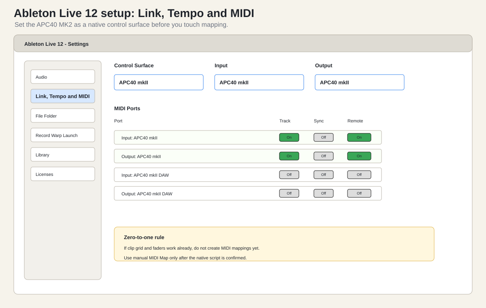{ width=100% }

## How To Use This Book

The book is chunked into sittings. Each chapter is one sitting: a short watch
segment, a hands-on build or exercise, and a checkpoint that tells you what you
should see and hear before moving on. Do not read ahead of your hands.

1. Read the chapter once.
2. Watch the video segment named in the chapter's watch box, if there is one.
3. Do the steps with your own hands on your own APC.
4. Verify the checkpoint.
5. Stop, or continue to the next chapter if you are fresh.

Checkpoints look like this:

> **Checkpoint.** The APC grid lights up with your clip colors and pressing a
> lit button starts a loop. If not, nothing later in the book will work; go to
> the troubleshooting chapter first.

Two more habits that pay off immediately:

- **Keep a practice photo journal.** At every checkpoint, take a quick phone
  photo of your own rig: the APC lights, the Ableton window, the Settings
  panel. When something breaks next week, you will have a picture of the last
  working state. Your own photos are also the only screenshots you can publish
  anywhere without rights questions.
- **Name and save constantly.** Every exercise here has an exact set name.
  Live crashes are rare, but a lost unnamed set kills a practice evening.

This book has a companion animated browser tutorial, "APC40 MK2 Don't Cry
Tonight Ableton Lab", on the project's GitHub Pages site. It walks the same
Don't Cry Tonight build step by step with an animated APC surface and Session
grid. Use the book for depth and the tutorial for rehearsal.

# Meet Ableton Live 12

Skip this chapter only if you have already made loops in Ableton. If you have
never seen Ableton — or any DAW — read this first. Nothing in it requires the
APC.

A DAW (digital audio workstation) is a program that records, plays, and loops
music. Ableton Live is a DAW with a special trick: **Session View**, a grid
where every cell holds a loop that you can start and stop in time with
everything else. The APC40 MK2 is a physical copy of that grid with real
buttons, real faders, and real knobs. Ableton is the instrument; the APC is how
you play it.

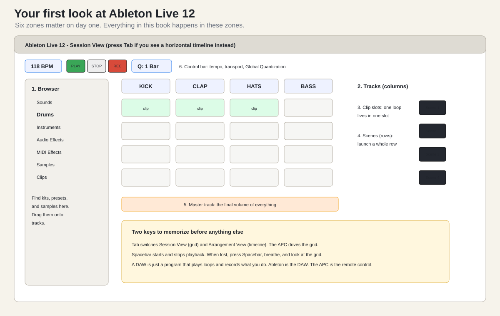{ width=100% }

When Live 12 opens you will see one of two layouts:

- **Session View**: a grid of rectangles arranged in columns. This is the view
  this whole book lives in.
- **Arrangement View**: a horizontal timeline, like a video editor. You will
  use it only at the very end, to record and review your performance.

Press the **Tab** key to flip between them. Do it a few times now so the flip
never surprises you again.

## The Six Zones That Matter

Match these against the plate above:

| Zone | What it is | Why you care |
|---|---|---|
| Browser (left edge) | Searchable library of instruments, kits, samples | Every sound in your set starts here. |
| Tracks (columns) | One instrument or sound source each | One APC column = one track. |
| Clip slots (cells) | Each holds one loop ("clip") | One APC grid button = one slot. |
| Scenes (rows) | A row of clips across all tracks | One APC scene button = one row. |
| Master (right column) | The final output level | If this is down, nothing is loud. |
| Control bar (top) | Tempo, play/stop/record, Global Quantization | Tempo lives here; so does the `1 Bar` launch grid. |

## Words This Book Uses Constantly

| Word | Meaning |
|---|---|
| Clip | One loop in one slot: a bar of drums, a chord pad, a riser. |
| Scene | A whole row of clips launched together: a musical section. |
| Launch | Start a clip or scene, quantized to the beat. |
| Quantization | Live waits for the next bar line before acting, so you cannot be off-beat. |
| Session ring | The red rectangle in Live showing which 8x5 block the APC currently controls. |
| Send / Return | A knob that feeds a track into a shared effect (reverb, delay). |
| Macro | One knob that controls a group of effect parameters at once. |
| Warp | Live stretching audio to match your tempo. |
| Arm | Make a track ready to record. |

## Three Keys, One Habit

- **Tab**: switch Session and Arrangement View.
- **Spacebar**: start and stop playback.
- **Cmd+S** (Ctrl+S on Windows): save. After every step that works.

> **Checkpoint.** You can open Live 12, say which view you are looking at,
> flip views with Tab, and point at the browser, a track, a clip slot, a scene,
> and the tempo field without hunting.

# Source Video Pack

The best zero-to-one path is not one video. APC40 MK2 videos tend to split into
three buckets: hardware operation, Live setup, and performance workflow. I used
the following source pack to shape this book.

Primary APC walkthrough:

- Meta Mind Music, "Learn the APC40 mk2 Controller In 30 - The best Ableton
  mixer!" Length: 29:56. URL:
  <https://www.youtube.com/watch?v=hUo2xowjr0U>
- Why it matters: this is the most useful APC40 MK2 beginner walkthrough found
  for the surface itself. Its chapter path covers setup, mixer controls,
  transport controls, device controls, clip/session controls, global controls,
  and pro tips.

Official APC walkthrough:

- Akai Professional, "APC40 mkII - Demo, Features, and Operation in Ableton
  Live." Length: 12:45. URL:
  <https://www.youtube.com/watch?v=IAWy2TVtXo8>
- Why it matters: this is the official APC40 mkII operation overview. It covers
  clips and scenes, mixer, device control, transport, track control, footswitch,
  and customization.

Workflow video:

- Random Noise, "Why I love this Ableton Controller and How I Use It." Length:
  25:40. URL: <https://www.youtube.com/watch?v=BoFqQGtyG3o>
- Why it matters: useful for thinking of the APC as an arranging and performance
  surface, not just a grid of buttons.

Fast arrangement overview:

- Tony Tyson, "A Really Quick Guide To Using The Akai APC40 MkII." Length: 9:02.
  URL: <https://www.youtube.com/watch?v=POb406So534>
- Why it matters: quick arrangement-on-the-fly overview. Good after the first
  setup works.

Set preparation:

- Isotonik Studios, "Ableton Live - Preparing your set for the APC40 /
  Launchpad." Length: 9:40. URL:
  <https://www.youtube.com/watch?v=76WvQNJB1bk>
- Why it matters: practical set-preparation ideas: crop clips, color tracks, and
  make the controller readable.

Ableton 12 Session View:

- MusicRadar Tech, "How to use Session View to turn loops into full tracks in
  Ableton Live 12." Length: 14:28. URL:
  <https://www.youtube.com/watch?v=o8diEg51rZs>
- Why it matters: Live 12 Session View framing for turning loop ideas into song
  structure.

Official documentation used for the exact behavior:

- Akai APC40 mkII User Guide:
  <https://cdn.inmusicbrands.com/akai/attachments/apc40II/APC40%20mkII%20-%20User%20Guide%20-%20v1.0.pdf>
- Ableton APC40 mkII controller page:
  <https://www.ableton.com/en/products/controllers/apc40mkii/>
- Ableton Live 12 Manual, MIDI and Key Remote Control:
  <https://www.ableton.com/en/manual/midi-and-key-remote-control/>
- Ableton Live 12 Manual, Session View:
  <https://www.ableton.com/en/manual/session-view/>
- Ableton Live 12 Manual, Launching Clips:
  <https://www.ableton.com/en/manual/launching-clips/>
- Ableton Help, Using Control Surfaces:
  <https://help.ableton.com/hc/en-us/articles/209774285-Using-Control-Surfaces>

## Watch Order

Do not watch the source pack in random order. Use this order:

1. Watch the Akai official APC40 mkII video once without touching anything.
2. Watch the Meta Mind Music video with the APC on your desk.
3. Pause at the setup section and configure Ableton exactly.
4. Watch the mixer and device-control sections while moving only those controls.
5. Watch the Isotonik set-preparation video after you understand the grid.
6. Watch the MusicRadar Live 12 Session View video when you are ready to turn
   loops into a performance.
7. Watch the Random Noise workflow video after you can launch, fade, mute, and
   record a simple set.

This book compresses that path into a single project.

## Watch In Segments, Not Marathons

Do not watch any of these videos end to end in one sitting. Each chapter of
this book names the one segment worth watching right before you do that
chapter's work. Use the chapter list under each YouTube video (or the chapter
markers on the seek bar) to jump straight to the named segment.

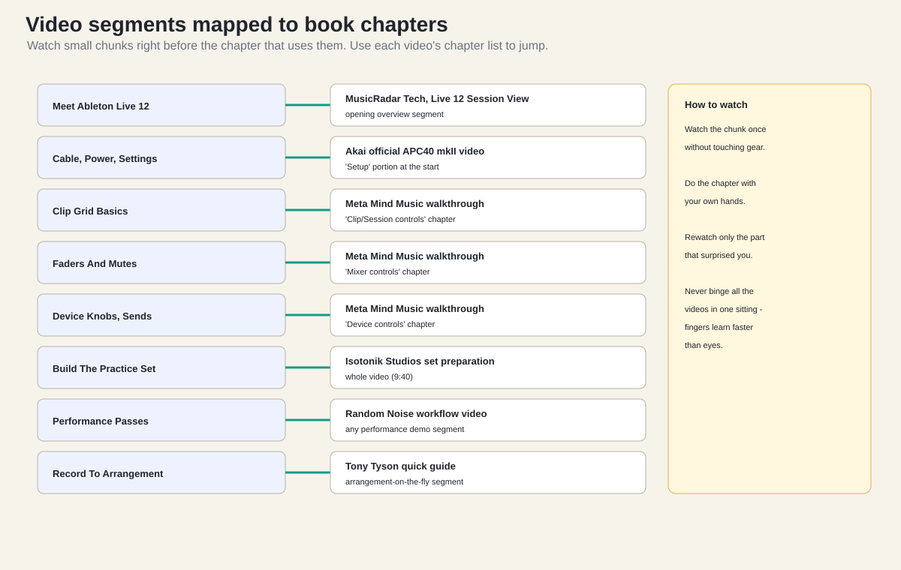{ width=100% }

| Before this chapter | Watch this segment |
|---|---|
| Meet Ableton Live 12 | MusicRadar Tech Live 12 video: the opening Session View overview. |
| Cable And Power + Settings | Akai official video: the setup portion at the start. |
| Clip Grid Basics | Meta Mind Music: the clip/session controls chapter. |
| Tracks, Faders, And Mutes | Meta Mind Music: the mixer controls chapter. |
| Channel Knobs and Device Control | Meta Mind Music: the device controls chapter. |
| Build The APC-Only Practice Set | Isotonik Studios set-preparation video, whole thing (9:40). |
| Performance chapters | Random Noise: any live performance demonstration segment. |
| Record The APC Performance | Tony Tyson: the arrangement-on-the-fly segment. |

The watch boxes in each chapter repeat this, so you never need to come back to
this table. The rule is always the same: watch the chunk once without touching
gear, do the chapter with your hands, rewatch only the part that surprised you.

# What The APC40 MK2 Is

The APC40 MK2 is not a keyboard. It is not primarily for playing melodies. It is
a physical control surface for Ableton Live's Session View and mixer. Ableton's
controller page describes the core idea: a 5 by 8 RGB clip-launching grid, nine
faders, eight channel control knobs, and eight device control knobs. The Akai
manual explains the same surface in operational terms: the eight columns are
tracks, the five rows are scenes, and the buttons at the right launch entire
scenes.

That gives you the whole mental model:

| Physical APC zone | Ableton job | First-day meaning |
|---|---|---|
| 8 by 5 clip grid | Session View clip slots | Start one loop on one track. |
| 5 scene buttons | Session rows | Start a whole musical section. |
| Clip Stop buttons | Track stops | Stop the currently playing clip in a column. |
| Track selectors | Track focus | Choose the track whose device you want to control. |
| Track activators | Mute/unmute | Create dropouts without touching the mouse. |
| Solo buttons | Isolate a track | Diagnose problems, not a normal performance move. |
| Record-arm buttons | Prepare tracks for recording | Useful later; not central to APC-only playback. |
| Track faders | Mixer volumes | Make the set feel alive. |
| Channel knobs | Pan, sends, or user mappings | Use Pan and Sends first; avoid User at first. |
| Device knobs | Current device parameters | Control macros, filters, delays, and racks. |
| Crossfader | A/B blend | Performance transitions. |
| Play, Record, Session | Transport and recording | Start Live, capture the performance. |

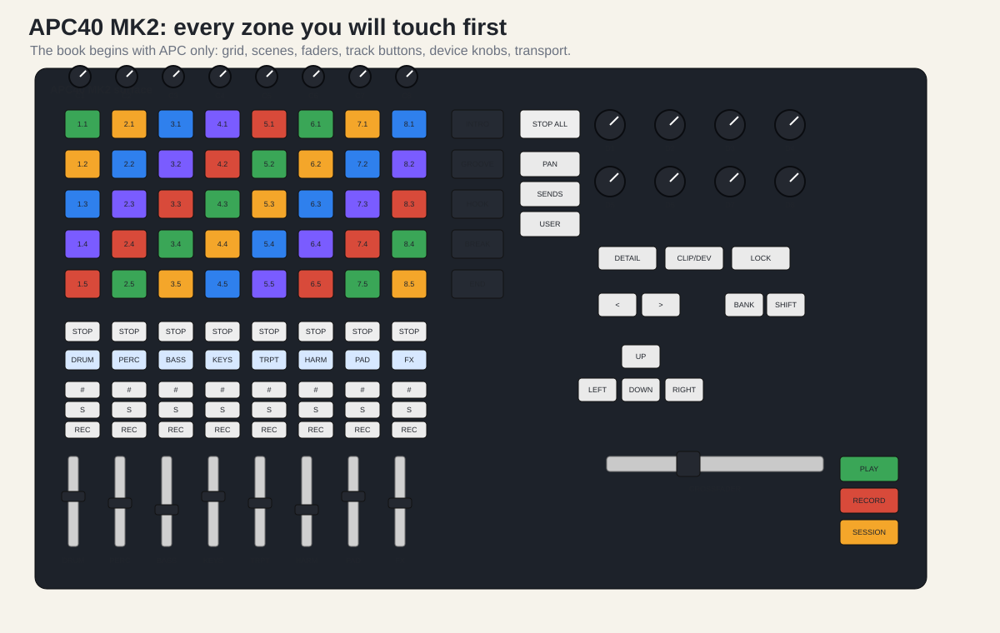{ width=100% }

## First-Day Rule

For the first day, do not manually MIDI-map anything until the native APC script
works. The APC40 MK2 is designed to correspond to Ableton Live automatically.
Manual mapping is powerful, but it can hide whether the native script is working.

Use this order:

1. Make Live recognize the APC40 MK2 as a Control Surface.
2. Confirm the grid rectangle appears in Session View.
3. Confirm clip launch buttons trigger clips.
4. Confirm faders move track volumes.
5. Confirm track activator buttons mute and unmute tracks.
6. Confirm Device Control knobs move the selected device.
7. Only then consider User mode or manual MIDI Map.

# Cable And Power

> **Watch first.** Akai official APC40 mkII video, the setup portion at the
> start: <https://www.youtube.com/watch?v=IAWy2TVtXo8>. Two minutes, then come
> back.

Before launching Live:

1. Put the APC40 MK2 flat on the desk.
2. Connect its USB cable directly to the Mac if possible.
3. Avoid a hub for the first setup.
4. Turn the APC power switch on.
5. Wait a moment for macOS to see it as a MIDI device.
6. Open Ableton Live 12.

The APC is USB-powered. If it does not light up, first suspect the cable, port,
or hub. A direct cable to the Mac removes one whole class of problems.

Do not connect the MPK, audio interface MIDI ports, or any other controller for
the first setup. If another MIDI controller is connected, Ableton can still work,
but troubleshooting becomes noisier.

# Ableton Live 12 Settings

Ableton 12 may call the window Settings. Older videos may say Preferences or
MIDI/Sync. Treat these as the same destination:

```text
Live > Settings > Link, Tempo and MIDI
```

On Windows, the path is usually:

```text
Options > Settings > Link, Tempo and MIDI
```

## Native Control Surface Setup

Use these exact choices first:

| Field | Set to |
|---|---|
| Control Surface | APC40 mkII |
| Input | APC40 mkII |
| Output | APC40 mkII |

If Ableton auto-detects the APC, these may already be filled in. If they are
filled in correctly, leave them alone.

If you see more than one APC port name, choose the pair that matches the normal
APC40 mkII input and output. Port names can vary slightly by macOS, Ableton
version, and driver state. The test is practical: after closing Settings, the
Session View ring should move when you bank the APC, and the clip grid should
light with the clip colors.

## MIDI Ports

For this beginner book:

| Port | Track | Sync | Remote |
|---|---|---|---|
| Input: APC40 mkII | On | Off | On |
| Output: APC40 mkII | On | Off | On |

Why:

- `Track` lets MIDI notes and control data reach tracks when needed.
- `Remote` lets Live receive controller commands and send feedback.
- `Sync` is not needed for APC-only setup unless you are synchronizing tempo
  with another device. Leave it off for now.

If your APC works with Track Off because the native script handles everything,
that is fine. The important beginner state is this: native Control Surface
selected, correct Input and Output selected, and Remote available for feedback
or manual mappings later.

## Immediate Test

After closing Settings:

1. Open Session View with the Tab key if Arrangement View is visible.
2. Create or open a set with at least one clip.
3. Look for Ableton's highlighted Session ring around a block of clips.
4. Press APC Bank Right.
5. The Session ring should move right.
6. Press Bank Left.
7. The Session ring should move back.

If the Session ring does not move, stop here. Do not continue to clip launching
yet. Go to the troubleshooting chapter and fix recognition first.

> **Checkpoint.** Live's Settings window shows `APC40 mkII` in all three
> Control Surface fields, and the red Session ring in Session View moves when
> you press the APC Bank arrows. Take a photo of the Settings panel for your
> practice journal — this is the screen you will want to compare against when
> something stops working.

# The First Empty Set

Create the simplest possible Ableton set before you build the Kiffness exercise.
This is your controller test set.

1. Open Live 12.
2. Create a new Live Set.
3. Switch to Session View.
4. Delete extra tracks until you have four tracks if you want less clutter.
5. Add one audio or MIDI clip to Track 1, Scene 1.
6. Add another clip to Track 2, Scene 1.
7. Add a third clip to Track 1, Scene 2.
8. Color the clips different colors.
9. Press the matching APC grid buttons.

Expected result:

- The clip launches on the next quantized boundary.
- The button color roughly follows the clip color.
- The playing state is visible from the APC.
- The corresponding Ableton clip slot also shows activity.

Do not worry about the music yet. This is a hardware check, not a song.

# Clip Grid Basics

> **Watch first.** Meta Mind Music walkthrough, the clip/session controls
> chapter: <https://www.youtube.com/watch?v=hUo2xowjr0U>. Use the chapter list
> under the video to jump to it.

The APC grid is eight columns by five rows.

- A column is a track.
- A row is a scene.
- A button is a clip slot.
- The five scene launch buttons on the right launch full rows.

The Akai manual says the current 8 by 5 matrix is represented in Live by a
rectangle around the clips. That is the key. You are not looking at the whole
Ableton set. You are looking at the part of the set currently under the APC.

## Clip Launch Buttons

To launch one clip:

1. Find the track column.
2. Find the scene row.
3. Press the grid button at that intersection.

If Global Quantization is set to `1 Bar`, the clip will usually wait until the
next bar before it starts. This is good. It keeps the performance in time.

If you press a clip and nothing happens:

1. Check that the slot actually contains a clip.
2. Check that you are in Session View.
3. Check that the Session ring is over the clip you think it is over.
4. Check that the track is not muted.
5. Check that the master volume is up.

## Scene Launch Buttons

To launch a whole musical section:

1. Look at the right edge of the APC grid.
2. Press the scene button for the row you want.
3. Wait for the quantized launch.
4. Use faders to shape the mix after the row starts.

Scene launching is the APC's superpower. A mouse can launch clips, but a mouse is
awkward for launching a row and riding faders. The APC makes the song structure
physical.

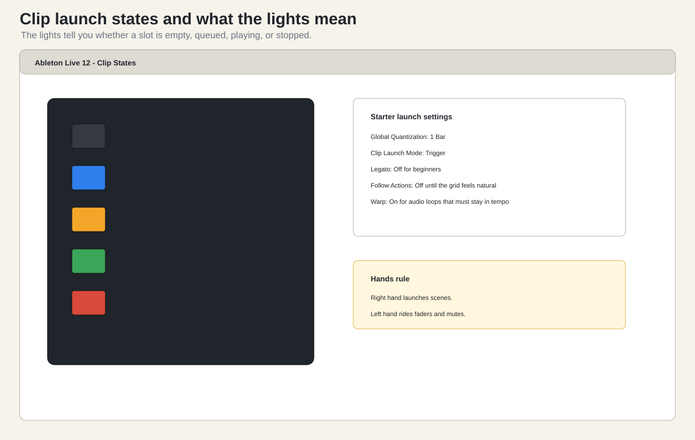{ width=100% }

# Stop Buttons

There are two kinds of stop actions to learn early.

## Clip Stop Per Track

The Clip Stop buttons sit under the clip grid, one per track. Pressing a Clip
Stop button stops the currently playing clip in that track column.

Use this for:

- removing percussion while bass continues;
- stopping a riser or one-shot FX track;
- cutting keys or pads for a break;
- ending one track while the rest of the scene continues.

## Stop All Clips

Stop All Clips stops the Session clips. It is your panic button and your clean
ending button.

Use this for:

- recovering from the wrong row;
- ending a practice pass;
- resetting before another take;
- proving to yourself that the APC is controlling the set.

Beginner mistake: pressing Live's main Stop button when you only meant to stop
one track. Use Clip Stop for one track. Use Stop All Clips for the entire grid.

# Tracks, Faders, And Mutes

> **Watch first.** Meta Mind Music walkthrough, the mixer controls chapter:
> <https://www.youtube.com/watch?v=hUo2xowjr0U>.

The APC40 MK2 becomes much more musical once you stop thinking of it as just a
clip launcher. It is also a mixer.

## Faders

Use faders with the left hand:

1. Start the Groove scene.
2. Put all faders down.
3. Raise drums.
4. Raise bass.
5. Raise keys or pads.
6. Bring in trumpet/hook later.
7. Keep FX low until the transition.

Do not slam every fader to the top. A good practice target is:

| Track | Starter fader position |
|---|---|
| Drums | medium-high |
| Percussion | low-medium |
| Bass | medium |
| Keys | medium-low |
| Trumpet/hook | medium, featured only when needed |
| Harmony | lower than lead |
| Pads | low but wide |
| FX | very low except transitions |

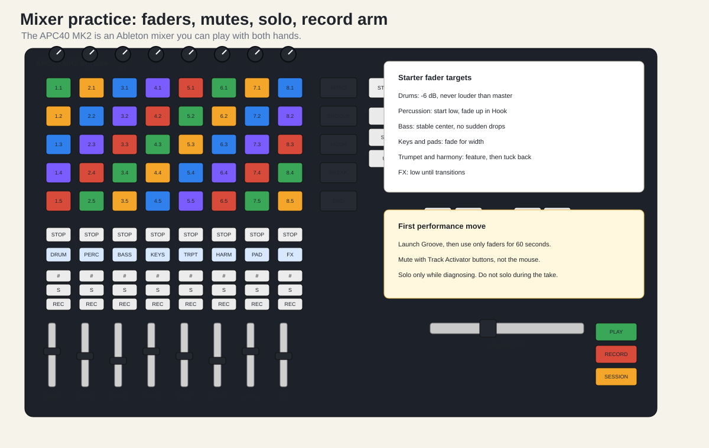{ width=100% }

## Track Activator Buttons

The Track Activator button is the mute/unmute button. It has the track number on
it. Use it to create arrangement movement.

Practice:

1. Launch Groove.
2. Let all tracks play for four bars.
3. Mute percussion for two bars.
4. Unmute percussion.
5. Mute drums for one bar before the Hook scene.
6. Launch Hook.

This teaches a crucial APC skill: performance is not only starting clips. It is
also removing layers.

## Solo Buttons

Solo is for diagnosis. If bass is too loud, solo bass, adjust, then unsolo.
Do not build your normal performance around Solo. Audiences do not need to hear
you check a track in isolation.

## Record Arm Buttons

Record Arm matters when recording into clips. Since this first book is APC-only,
use Record Arm later. For now, the APC is mainly launching and mixing clips that
already exist.

# Channel Knobs: Pan, Sends, User

The row of eight assignable knobs can do different things depending on mode.

## Pan Mode

Press `Pan`. Now the eight assignable knobs control panning for the current
eight tracks.

Beginner pan map:

| Track | Pan |
|---|---|
| Drums | center |
| Percussion | slightly right |
| Bass | center |
| Keys | slightly left |
| Trumpet | center or slightly right |
| Harmony | left/right spread |
| Pads | wide but not extreme |
| FX | whatever makes the transition audible |

Do not over-pan bass or kick. Keep low-frequency foundation centered.

## Sends Mode

Press `Sends`. By default, the knobs control Send A for the current eight tracks.
If Send A is reverb, each knob controls how much reverb each track receives.

To select another send, the Akai manual describes this gesture:

1. Hold `Sends`.
2. Press Track Selector 1 for Send A.
3. Press Track Selector 2 for Send B.
4. Release `Sends`.
5. Turn the assignable knobs.

Beginner return-track plan:

| Return | Effect | Use |
|---|---|---|
| Return A | Reverb | pads, trumpet, harmony, ending tail |
| Return B | Delay | trumpet stab, vocal chop, FX throw |

## User Mode

User mode is for manual MIDI mapping. Do not use it during the first setup. Use
it only after:

1. native clip launch works;
2. faders work;
3. mutes work;
4. device knobs work;
5. you know what single parameter is missing from your normal workflow.

Beginner User mode mapping:

1. Press `User`.
2. In Live, press MIDI Map.
3. Click a parameter, such as Auto Filter Frequency on the FX track.
4. Turn Assignable Knob 8.
5. Exit MIDI Map.
6. Save the set as a template if the mapping is useful.

Manual mappings live in the Live Set. They do not automatically become a global
APC behavior for every project.

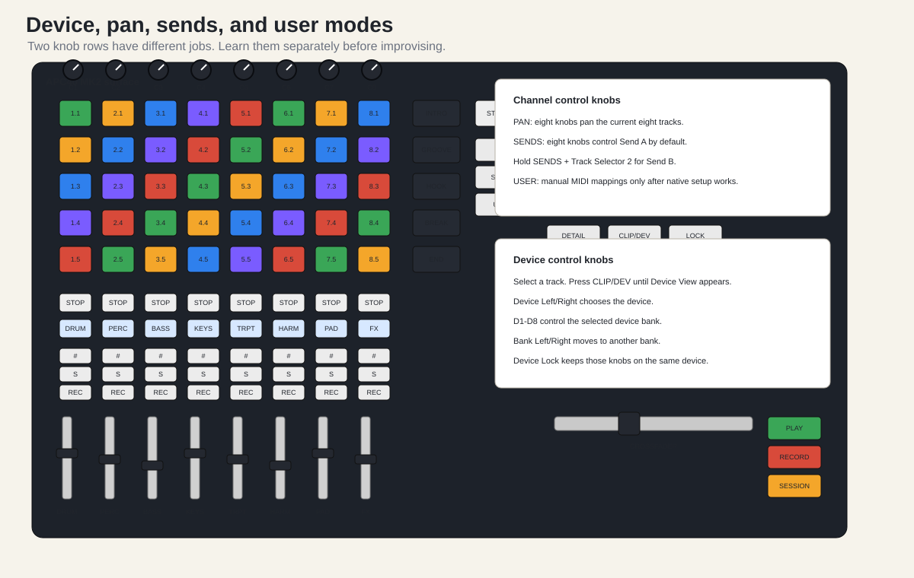{ width=100% }

# Device Control Knobs

> **Watch first.** Meta Mind Music walkthrough, the device controls chapter:
> <https://www.youtube.com/watch?v=hUo2xowjr0U>.

The eight Device Control knobs are different from the Channel knobs. Device
Control follows the selected track and selected device.

Use this sequence:

1. Press Track Selector 7 for `PADS`.
2. Press `Clip/Dev View` until Device View is visible.
3. Use Device Left/Right to select the device or rack you want.
4. Turn Device Control Knob 1.
5. Watch the selected device parameter move.
6. Turn Device Control Knob 2.
7. Use Bank Left/Right if the device has more than eight parameters.
8. Press Device Lock if you want the APC to stay locked to that device.

## Beginner Macro Rack

Create an Audio Effect Rack on the FX or PADS track with these macros:

| Macro | Device knob | Parameter |
|---|---:|---|
| Filter Cutoff | D1 | Auto Filter Frequency |
| Filter Res | D2 | Auto Filter Resonance |
| Echo Wet | D3 | Echo Dry/Wet |
| Echo Feedback | D4 | Echo Feedback |
| Reverb Wet | D5 | Reverb Dry/Wet |
| Reverb Size | D6 | Reverb Size |
| Utility Gain | D7 | Utility Gain |
| Width | D8 | Utility Width |

For the first week, lock the APC to this rack. This makes the Device Control
knobs predictable while your hands learn the surface.

# Bank And Session Navigation

The APC grid shows only eight tracks by five scenes at a time. Bigger Live Sets
are normal, but the APC needs a current window into them.

## Bank Select Buttons

Use the arrow buttons to move the selection one track or scene at a time.

Use this for small moves:

- Track 1 to Track 2;
- Scene 1 to Scene 2;
- selecting the next device or slot without a mouse.

## Bank Button Plus Arrows

Hold `Bank` and press an arrow to move the entire controlled grid:

- left/right by eight tracks;
- up/down by five scenes.

Beginner advice: do not need this in the first APC-only Kiffness practice set.
Stay inside eight tracks and five scenes. Save big-set navigation for later.

## Shift And Session Overview

Holding `Shift` can put the clip grid into Session Overview. In that view, each
button represents a larger 8-track by 5-scene block in Live. This is excellent
for big sets and confusing on day one.

Day-one rule:

1. Know that Session Overview exists.
2. Do not use it for the first exercise.
3. Build the first set to fit one APC grid.

# Kiffness Practice Track Choice

The selected practice track is:

```text
Oh Long Johnson x The Kiffness
```

Why this one:

- It has more usable layers than a tiny three-part loop.
- The local Kiffness layer inventory includes drums, percussion, bass, keys,
  trumpet, trumpet harmonies, vocal harmonies, pads, and related transitions.
- It exercises the entire APC surface without requiring the MPK.
- It can be practiced legally as a structure and controller exercise using your
  own sounds, not as a copy of the recording.

Do not rip the source audio. Do not copy lyrics. Do not include video frames in
your final practice artifact. Build an original set that borrows the layer logic:
drums, percussion, bass, keys, trumpet-like hook, harmonies, pads, and FX.

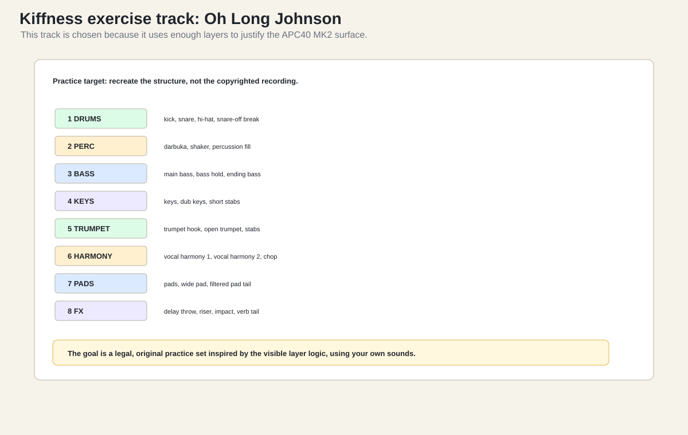{ width=100% }

# Build The APC-Only Practice Set

> **Watch first.** Isotonik Studios, "Preparing your set for the APC40 /
> Launchpad", the whole 9:40: <https://www.youtube.com/watch?v=76WvQNJB1bk>.
> This is the one video worth watching end to end before building a set.

Create exactly eight tracks and five scenes. Keep the whole first performance
inside one APC grid.

## Track Columns

Name the tracks:

1. `DRUMS`
2. `PERC`
3. `BASS`
4. `KEYS`
5. `TRUMPET`
6. `HARMONY`
7. `PADS`
8. `FX`

Color the tracks by family:

| Track | Color idea |
|---|---|
| DRUMS | green |
| PERC | yellow or amber |
| BASS | blue |
| KEYS | purple |
| TRUMPET | red |
| HARMONY | pink |
| PADS | teal |
| FX | gray or orange |

The colors matter because the APC grid reflects clip colors. A readable set is
easier to play.

## Scene Rows

Create five scenes:

1. `INTRO`
2. `GROOVE`
3. `HOOK`
4. `BREAK`
5. `END`

Beginner scene logic:

| Scene | Musical job | APC job |
|---|---|---|
| INTRO | small texture | start calmly |
| GROOVE | main beat and bass | lock the loop |
| HOOK | full recognizable moment | launch the biggest row |
| BREAK | remove drums or reduce density | practice mutes/faders |
| END | tails and stop | finish cleanly |

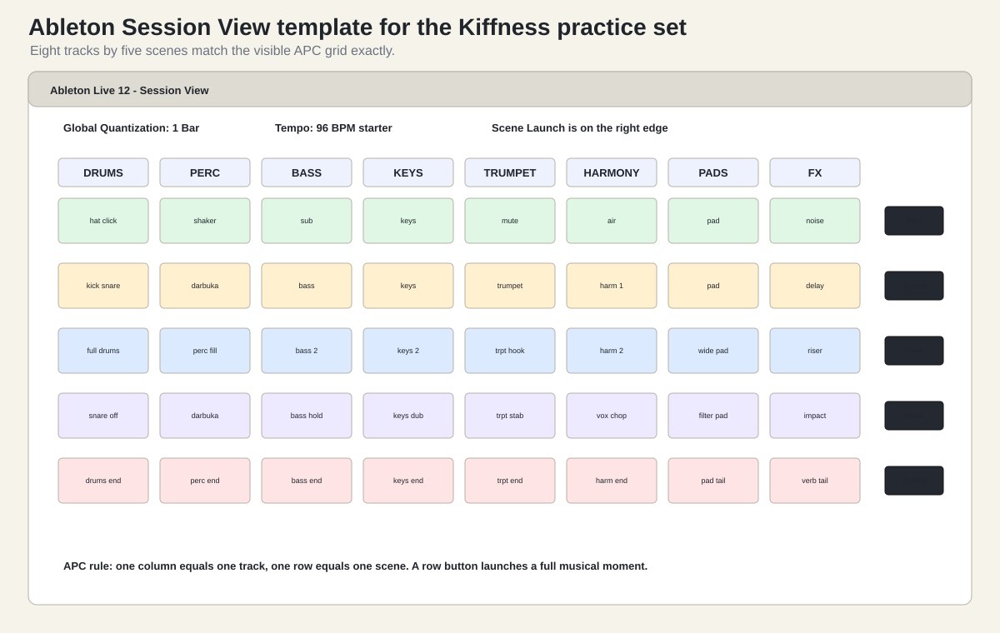{ width=100% }

## Clip Slot Plan

Use placeholder clips if you do not have sounds yet. The point is controller
fluency.

| Scene | DRUMS | PERC | BASS | KEYS | TRUMPET | HARMONY | PADS | FX |
|---|---|---|---|---|---|---|---|---|
| INTRO | hat click | shaker | sub pulse | keys hint | mute | air | pad | noise |
| GROOVE | kick snare | darbuka | bass | keys | trumpet | harm 1 | pad | delay |
| HOOK | full drums | perc fill | bass 2 | keys 2 | trpt hook | harm 2 | wide pad | riser |
| BREAK | snare off | darbuka | bass hold | keys dub | trpt stab | vox chop | filter pad | impact |
| END | drums end | perc end | bass end | keys end | trpt end | harm end | pad tail | verb tail |

If a clip is missing, leave the slot empty. Empty slots are better than a messy
unlabeled set.

## Global Quantization

Set Global Quantization to `1 Bar`.

Why:

- It lets you press a scene button slightly early.
- It keeps launches musical.
- It gives your hands time to move from scene buttons to faders.

Later, try `1/4` for fast cuts. Do not start there.

# First Performance: Scene Buttons Only

This exercise uses no faders, no knobs, no mutes. Only scene buttons.

1. Put all track faders around the same medium level.
2. Press Play.
3. Press Scene 1: `INTRO`.
4. Count four bars.
5. Press Scene 2: `GROOVE`.
6. Count eight bars.
7. Press Scene 3: `HOOK`.
8. Count eight bars.
9. Press Scene 4: `BREAK`.
10. Count four bars.
11. Press Scene 3 again: `HOOK`.
12. Count four bars.
13. Press Scene 5: `END`.
14. Press Stop All Clips.

Do this three times before touching faders. The goal is to trust the grid.

# Second Performance: Add Faders

Repeat the scene-button performance, but add fader moves.

## Intro

1. Pull `DRUMS`, `PERC`, and `TRUMPET` down.
2. Leave `PADS` and `FX` low.
3. Launch `INTRO`.
4. Raise only `PADS` slightly.

## Groove

1. Launch `GROOVE`.
2. Raise `DRUMS`.
3. Raise `BASS`.
4. Bring `PERC` up slowly.
5. Keep `TRUMPET` lower than you think.

## Hook

1. Launch `HOOK`.
2. Raise `TRUMPET`.
3. Raise `HARMONY`.
4. Push `PADS` wider if needed.
5. Keep `FX` controlled.

## Break

1. Launch `BREAK`.
2. Pull `DRUMS` down or mute it.
3. Let `BASS`, `PADS`, and `FX` breathe.
4. Prepare your hand over the `HOOK` scene button.

## End

1. Launch `END`.
2. Fade `DRUMS` and `BASS` out first.
3. Let `PADS` and `FX` tail.
4. Press Stop All Clips when the tail feels done.

# Third Performance: Add Mutes

Mutes are more decisive than faders. Practice them after the fader pass.

Try this:

1. Launch `GROOVE`.
2. Mute `PERC` for two bars.
3. Unmute `PERC`.
4. Mute `DRUMS` for one bar.
5. Launch `HOOK`.
6. Mute `PADS` for one bar inside the hook.
7. Unmute `PADS`.
8. Launch `BREAK`.
9. Mute `TRUMPET`.
10. Launch `END`.

The trick is to think in bars, not random button presses. A mute should sound
like an arrangement decision.

# Fourth Performance: Add Sends

Set Return A to Reverb and Return B to Delay.

## Reverb Pass

1. Press `Sends`.
2. Select Send A if needed.
3. Launch `HOOK`.
4. Add reverb to `TRUMPET`, `HARMONY`, and `PADS`.
5. Keep `BASS` and `DRUMS` mostly dry.
6. Launch `END`.
7. Increase reverb on `PADS` and `FX`.

## Delay Pass

1. Hold `Sends`.
2. Press Track Selector 2 to select Send B.
3. Launch `BREAK`.
4. Add delay to `TRUMPET` stab and `FX`.
5. Pull delay down before returning to `HOOK`.

Beginner warning: sends accumulate. If everything is in reverb and delay, the
mix loses punch. Use sends for contrast.

# Fifth Performance: Device Control

Build one device rack on `PADS` or `FX`. Lock the APC to it.

Recommended rack:

1. Auto Filter.
2. Echo.
3. Reverb.
4. Utility.

Map the first eight macros:

1. Filter Cutoff.
2. Filter Resonance.
3. Echo Wet.
4. Echo Feedback.
5. Reverb Wet.
6. Reverb Size.
7. Utility Gain.
8. Width.

Use it this way:

1. Select the `FX` track.
2. Press `Clip/Dev View` until Device View appears.
3. Select the rack.
4. Press `Device Lock`.
5. Launch `GROOVE`.
6. Slowly open Filter Cutoff.
7. Launch `HOOK`.
8. Increase Echo Wet for one bar.
9. Pull Echo Wet down.
10. Launch `END`.
11. Increase Reverb Wet and Width.

One good effect move is better than eight nervous knob moves.

# Sixth Performance: Crossfader

The crossfader is optional on day one, but the APC gives you a real one, so it
is worth a controlled exercise.

Assign tracks:

| Track | Crossfader assignment |
|---|---|
| DRUMS | A |
| PERC | A |
| BASS | A |
| KEYS | Off |
| TRUMPET | B |
| HARMONY | B |
| PADS | B |
| FX | B |

Exercise:

1. Put the crossfader all the way left.
2. Launch `GROOVE`.
3. You should hear the A-side rhythm section.
4. Slowly move the crossfader to the center.
5. Launch `HOOK`.
6. Move the crossfader right to reveal B-side melodic layers.
7. Move back to center before `BREAK`.

Do not use the crossfader as a volume fader. Use it as a transition control.

# Record The APC Performance

> **Watch first.** Tony Tyson, "A Really Quick Guide To Using The Akai APC40
> MkII", the arrangement-on-the-fly segment:
> <https://www.youtube.com/watch?v=POb406So534>.

Once the practice set works, record one pass into Arrangement View.

1. Save the set as `APC Oh Long Johnson Practice 01`.
2. Return to Session View.
3. Set Global Quantization to `1 Bar`.
4. Press Stop All Clips.
5. Put faders in starting positions.
6. Press Arrangement Record in Live or the APC Record button if it is assigned
   to Arrangement Record.
7. Press Play.
8. Perform the five-scene structure.
9. Use faders, mutes, sends, and one device rack move.
10. Press Stop twice.
11. Switch to Arrangement View.
12. Listen back.
13. Save the set as `APC Oh Long Johnson Practice 01 - recorded`.

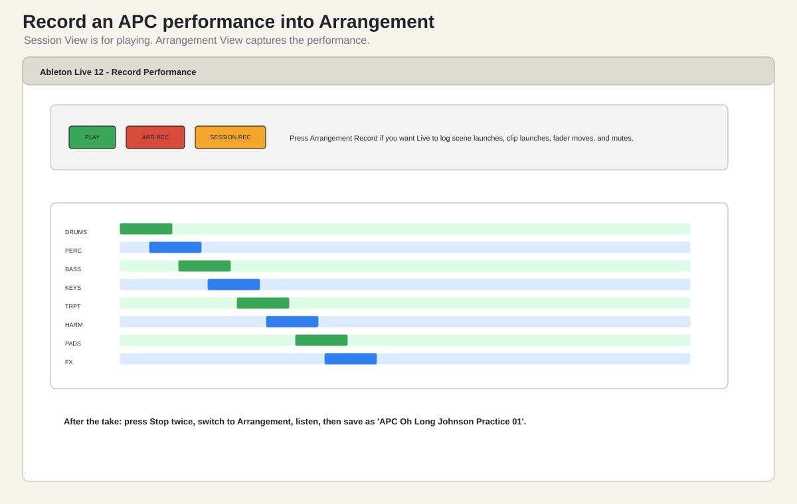{ width=100% }

## What Gets Recorded

Arrangement recording can capture:

- scene launches;
- clip launches;
- fader moves;
- track activator changes;
- device macro movements;
- send changes;
- crossfader movement.

This is why the APC matters. You are not only triggering loops. You are playing
the arrangement.

# Recreate Don't Cry Tonight With APC40 And Ableton

Reference video:

```text
Savage & John.E.S - Don t cry tonight (The official remix)
https://www.youtube.com/watch?v=zuHLHvZv4Ac
Length: 5:47
Uploader: John E.S
```

This chapter translates the mix into an APC40 MK2 and Ableton Live 12 practice
set. It does not ask you to copy the original recording, rip the video audio, or
publish a remake with uncleared material. The practical goal is to recreate the
arrangement feel: Italo-disco pulse, octave bass, emotional synth chords,
lead/vocal focus, risers, delay throws, wide chorus, break, and final tag.

Use one of these legal source approaches:

| Source approach | Use it for |
|---|---|
| Your own voice | Best personal version. Sing or speak a short guide phrase. |
| Lead synth | Best first APC-only version, because no microphone is needed. |
| Cleared vocal phrase | Best polished version if you have rights. |
| Private study reference | Fine for learning privately; do not publish uncleared audio. |

This chapter is more advanced than the first Kiffness exercise because it uses
eight scenes instead of five. That means the APC stays in one visible 8 by 5
grid for the first five scenes, then you press the Down arrow three times to
bring scenes 6-8 into the window (the ring moves one scene per press). That
navigation move is deliberate: it teaches you to move the APC session window
without turning the set into chaos.

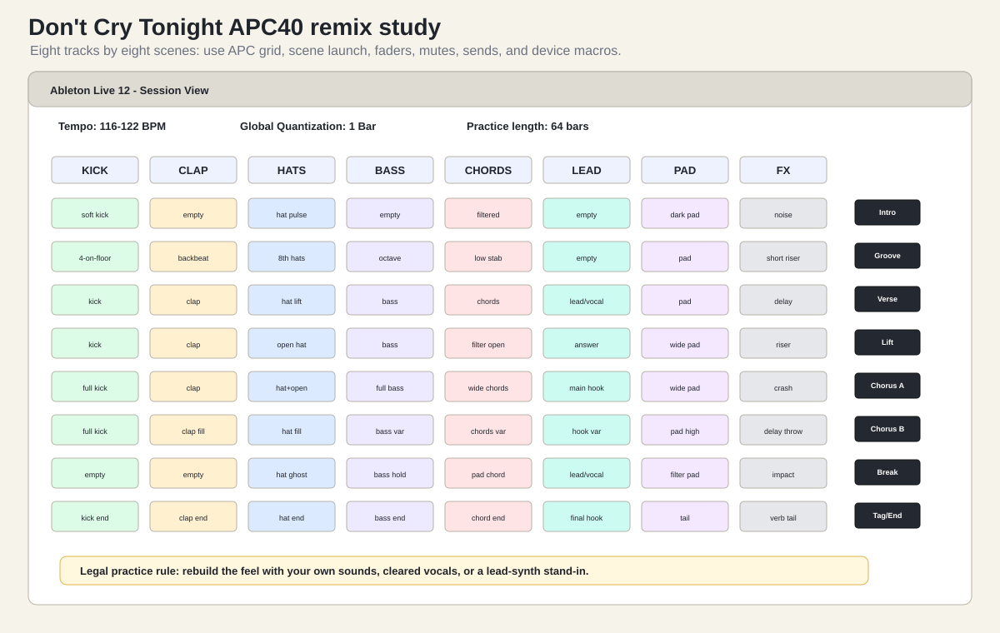{ width=100% }

## Listen Like A Remixer

Before building anything, study the reference the way a remixer does: with a
worksheet, not a couch. Play the 5:47 video twice. The first time, just listen.
The second time, pause at every change and fill in a table like this with your
own timestamps:

| Your timestamp | Section name | What enters | What leaves |
|---|---|---|---|
| 0:00 | Intro | ... | ... |
| ... | First groove | ... | ... |
| ... | Verse | ... | ... |
| ... | Chorus | ... | ... |
| ... | Break | ... | ... |
| ... | Final tag | ... | ... |

You are listening for six specific ingredients, because they map directly onto
the eight APC columns you are about to build:

1. The four-on-the-floor kick and where it drops out.
2. The clap or snare backbeat and its fills.
3. The hi-hat pattern: closed eighths, open hats on the off-beats.
4. The octave-bouncing Italo bass.
5. The emotional chord bed and the wide chorus pads.
6. The lead/vocal hook, its delay throws, and the reverb tails.

Write the answers in your own words. The point of the worksheet is that when
you later ask "what should happen in scene 4?", you answer from your own ears,
not from this book. This study stays private; the set you build uses your own
sounds.

## Ableton Project Setup

Create a new Live Set and save it immediately:

```text
APC Dont Cry Tonight Practice 01
```

Set:

| Setting | Value |
|---|---|
| Tempo | 116-122 BPM |
| Time signature | 4/4 |
| Global Quantization | 1 Bar |
| Count-in | 1 Bar if recording new material |
| Warp | On for audio loops that must follow tempo |
| Arrangement length target | 64 bars for the first practice version |

Start at 118 BPM if you do not know where to begin. The earlier GarageBand study
used 116-122 BPM as the safe range. Stay in that range until the groove feels
right.

## Track Columns

Use eight tracks so the first APC grid maps perfectly to the set:

| APC column | Ableton track | Purpose |
|---:|---|---|
| 1 | `KICK` | Four-on-the-floor pulse and section anchor. |
| 2 | `CLAP` | Backbeat, fills, and chorus lift. |
| 3 | `HATS` | Eighth-note motion, open-hat transitions, ghost hats. |
| 4 | `BASS` | Italo octave bass and bass holds. |
| 5 | `CHORDS` | Analog pad, synth strings, minor/major emotional bed. |
| 6 | `LEAD` | Lead synth, sung guide, or cleared vocal phrase. |
| 7 | `PAD` | Wide pad, filtered pad, chorus width, ending tail. |
| 8 | `FX` | Risers, impacts, delay throws, noise, reverb tails. |

Color the track headers and clips by family:

| Track | Color |
|---|---|
| `KICK` | green |
| `CLAP` | amber |
| `HATS` | blue |
| `BASS` | purple |
| `CHORDS` | red or rose |
| `LEAD` | teal |
| `PAD` | violet |
| `FX` | gray or orange |

Do not add more tracks for the first pass. If you need extra layers, resample or
combine them into the existing columns. The APC is easiest when one column has
one job.

## Scene Rows

Create eight scenes:

| Scene | Bars | Job |
|---:|---|---|
| 1 `INTRO` | 1-8 | Filtered mood: kick hint, hat pulse, dark pad, noise. |
| 2 `GROOVE` | 9-16 | Four-on-floor, clap, hats, octave bass. |
| 3 `VERSE` | 17-24 | Lead or vocal stand-in enters over restrained arrangement. |
| 4 `LIFT` | 25-32 | Open hat, filter opening, riser, wider pad. |
| 5 `CHORUS A` | 33-40 | Full drums, full bass, chords, main hook, crash. |
| 6 `CHORUS B` | 41-48 | Variation: fills, answer phrase, delay throw. |
| 7 `BREAK` | 49-56 | Drums reduced, pad/lead focus, impact into return. |
| 8 `TAG/END` | 57-64 | Final hook, bass ending, reverb tail, clean stop. |

Scenes 1-5 are visible in the first APC window. To reach scenes 6-8, press the
APC Down arrow three times after launching `CHORUS A` — each press moves the
Session ring down by one scene, so three presses put scenes 4-8 under the grid.
Practice that movement slowly: launch `CHORUS A`, press Down, Down, Down, rest
your right hand near the scene buttons, and launch `CHORUS B` on the next
count of 4.

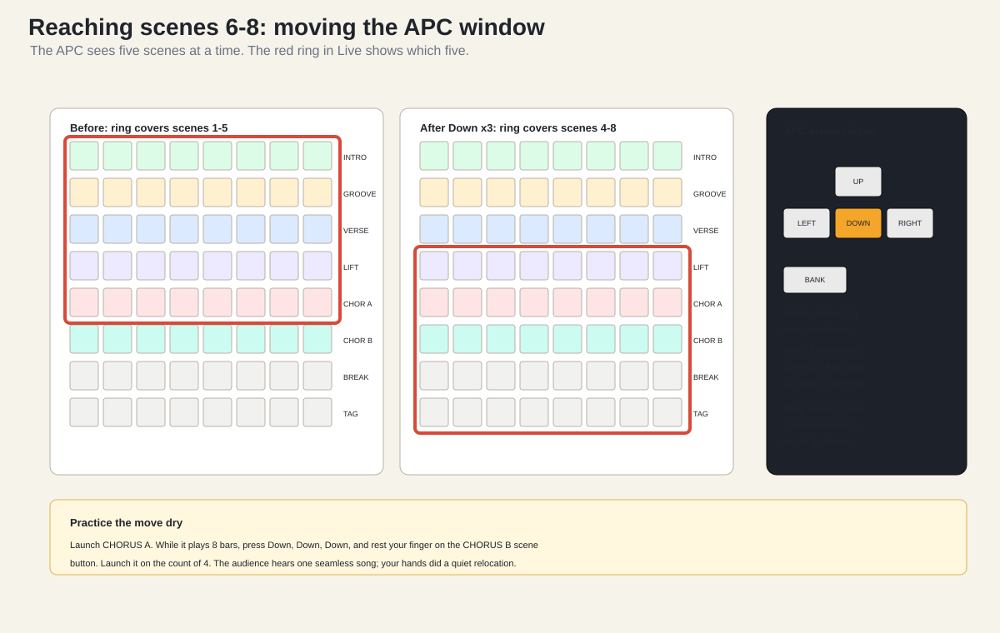{ width=100% }

## Clip Slot Plan

Build these clips even if they are placeholders at first:

| Scene | KICK | CLAP | HATS | BASS | CHORDS | LEAD | PAD | FX |
|---|---|---|---|---|---|---|---|---|
| INTRO | soft kick | empty | hat pulse | empty | filtered | empty | dark pad | noise |
| GROOVE | 4-on-floor | backbeat | 8th hats | octave | low stab | empty | pad | short riser |
| VERSE | kick | clap | hat lift | bass | chords | lead/vocal | pad | delay |
| LIFT | kick | clap | open hat | bass | filter open | answer | wide pad | riser |
| CHORUS A | full kick | clap | hats+open | full bass | wide chords | main hook | wide pad | crash |
| CHORUS B | full kick | clap fill | hat fill | bass var | chords var | hook var | pad high | delay throw |
| BREAK | empty | empty | hat ghost | bass hold | pad chord | lead/vocal | filter pad | impact |
| TAG/END | kick end | clap end | hat end | bass end | chord end | final hook | tail | verb tail |

For the first APC-only version, you can make every clip a simple loop or one
shot. The important thing is that every clip slot has a clear job and a readable
name.

## Sound Design Starter Choices

Use Ableton stock devices first:

| Track | Instrument or source | First effect |
|---|---|---|
| `KICK` | Drum Rack or one-shot audio | EQ Eight high-cut only if needed |
| `CLAP` | Drum Rack clap/snare | short room reverb send |
| `HATS` | Drum Rack hats | Auto Pan or subtle velocity variation |
| `BASS` | Analog, Drift, or Wavetable | Auto Filter, light saturation |
| `CHORDS` | Analog pad or synth strings | Auto Filter, Chorus-Ensemble |
| `LEAD` | bright mono lead or vocal audio | Echo send for phrase endings |
| `PAD` | wide pad or resampled chord | Reverb send, filter macro |
| `FX` | noise, riser, impact, reverse cymbal | Echo, Reverb, Utility |

For the lead/vocal part, begin with a synth. A synth lead lets you learn the APC
arrangement without stopping to solve microphone gain, comping, lyric rights, or
vocal tuning.

## Build Every Clip, Step By Step

This section is the complete zero-to-one build. If you have never made a clip
in Ableton before, follow it literally; every mouse action is written out. At
the end you will have all 55 non-empty clips from the clip slot plan, and the
whole set will be playable from the APC without touching the computer.

Budget two sittings for the build: drums and bass in the first, chords, lead,
FX, and scene variations in the second.

### Step 1: Tempo, Metronome, Count-In

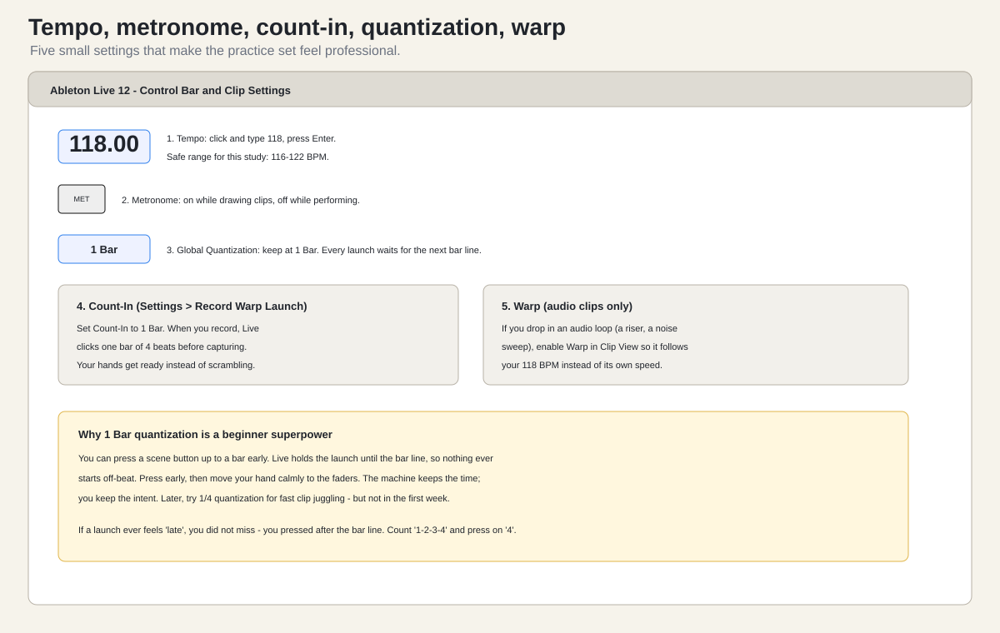{ width=100% }

1. Open your saved `APC Dont Cry Tonight Practice 01` set.
2. Click the tempo field at the top left and type `118`, then press Enter.
3. Click the metronome button (two small circles) so it lights. You want the
   click while drawing and recording clips; you will turn it off to perform.
4. Open `Live > Settings > Record Warp Launch` and set Count-In to `1 Bar`.
5. Confirm the Global Quantization menu in the control bar shows `1 Bar`.
6. Save.

> **Checkpoint.** Press Spacebar. You hear a click at 118 BPM and the play
> position moves. Press Spacebar again to stop.

### Step 2: Load The Drum Kit On Three Tracks

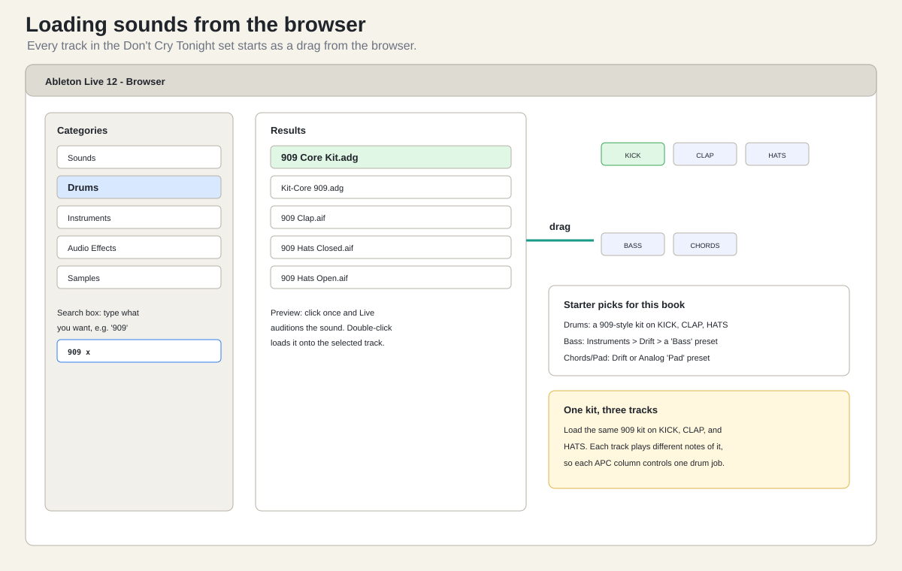{ width=100% }

The `KICK`, `CLAP`, and `HATS` columns all play the same drum kit, so each APC
column controls one drum job.

1. In the browser, click `Drums`.
2. Type `909` in the search box. Italo disco and its descendants live on
   909-style kits. Any "909 Core Kit" or similar stock kit works.
3. Click a kit once to preview it. Click a few; pick the one that sounds like
   the reference groove to you.
4. Drag the kit onto the `KICK` track header.
5. Drag the same kit onto `CLAP` and `HATS`.
6. Click the `KICK` track header, then play a few keys of your computer
   keyboard (`A` row) or tap the pads in the kit view to hear the sounds.

If you cannot hear the preview clicks, check the browser's headphone icon
(preview on/off) and the master fader.

> **Checkpoint.** Selecting each of the three drum tracks and pressing keys
> makes drum sounds. The same kit name shows in the device area at the bottom
> of all three tracks.

### Step 3: Draw The GROOVE Drum Clips

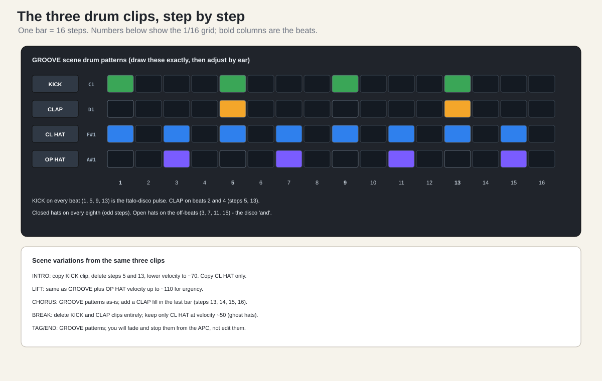{ width=100% }

Draw, do not record, the first patterns. Drawing teaches you where the notes
live; recording comes later when your hands know the groove.

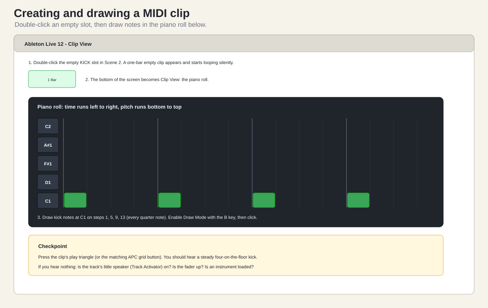{ width=100% }

The kick:

1. Double-click the empty `KICK` slot in the `GROOVE` scene row. An empty
   one-bar MIDI clip appears, and Clip View opens at the bottom.
2. In Clip View, find the kick drum row. In a 909-style Drum Rack it is `C1`;
   Live highlights the row name when you click a note lane.
3. Press `B` to enable Draw Mode.
4. Click steps 1, 5, 9, and 13 on the `C1` row: a note on every beat.
5. Press the small play triangle on the clip (or the matching APC button).
   Four-on-the-floor. Let it loop.

The clap:

1. Double-click the empty `CLAP` slot in the `GROOVE` row.
2. Find the clap row (`D#1` or `D1` depending on the kit; click lanes until
   you hear the clap).
3. Draw notes on steps 5 and 13: beats 2 and 4.
4. Launch the `GROOVE` scene from the APC. Kick and clap together.

The hats:

1. Double-click the empty `HATS` slot in the `GROOVE` row.
2. Closed hat (`F#1`): draw every odd step: 1, 3, 5, 7, 9, 11, 13, 15.
3. Open hat (`A#1`): draw steps 3, 7, 11, and 15 — the disco "and" after every
   beat. Delete the closed-hat notes on those same steps if the two sound
   cluttered together.
4. Launch `GROOVE` again. This is the Italo-disco engine room.

> **Checkpoint.** Pressing the `GROOVE` scene button on the APC plays kick,
> clap, and hats locked together at 118 BPM, and the three grid buttons show
> playing green in Live and lit on the APC.

### Step 4: The Octave Bass

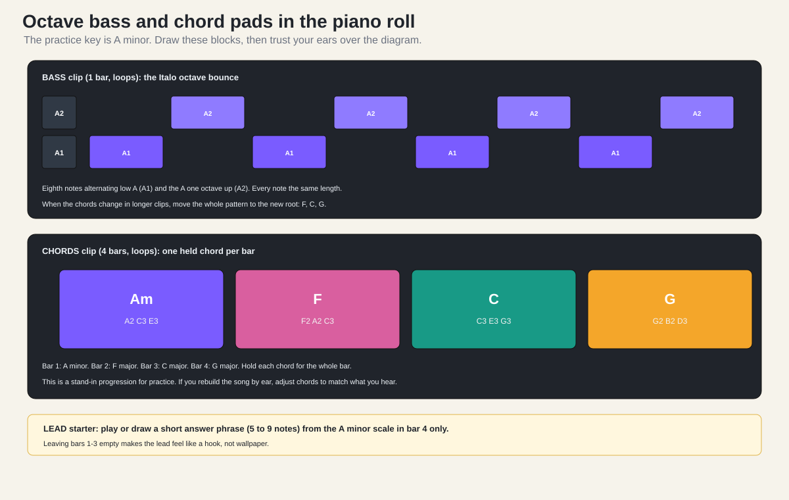{ width=100% }

The practice key is A minor. (The reference may sit in a different key; A minor
keeps every note on easy landmarks while you learn the surface. Transpose later
if your ears object.)

1. In the browser, click `Instruments`, open `Drift`, and find a bass preset.
   Preview a few; you want round and punchy, not fizzy.
2. Drag it onto the `BASS` track.
3. Double-click the empty `BASS` slot in the `GROOVE` row.
4. Draw eighth notes alternating `A1` and `A2`: low A on the beat, high A on
   the off-beat, eight notes total, all the same length.
5. Launch `GROOVE`. The octave bounce against the four-on-the-floor kick is
   the sound that makes people say "that's 80s".

If the bass drowns the kick, pull the `BASS` fader down a touch — from the APC,
not the mouse.

### Step 5: Chords And Pad

1. Load a pad preset (Drift or Analog, anything labelled pad or strings) onto
   `CHORDS`, and a second, wider or softer pad onto `PAD`.
2. Double-click the empty `CHORDS` slot in the `VERSE` row.
3. In Clip View, drag the loop brace to make the clip 4 bars long.
4. Draw one held chord per bar, each lasting the whole bar:
   bar 1 `A2 C3 E3` (A minor), bar 2 `F2 A2 C3` (F), bar 3 `C3 E3 G3` (C),
   bar 4 `G2 B2 D3` (G).
5. Copy this clip into the `LIFT`, `CHORUS A`, and `CHORUS B` rows: click the
   clip, press Cmd+C, click the target slot, press Cmd+V.
6. On `PAD`, make a 4-bar clip in `INTRO` holding just `A2 E3` (a bare,
   open fifth reads as "dark intro" instantly), and a full-chord wide version
   in `CHORUS A`.

> **Checkpoint.** Launching `VERSE` from the APC plays drums, bass, and a
> four-chord progression that resolves back to A minor every four bars.

### Step 6: The Lead Hook

The lead stands in for the vocal. Keep it almost embarrassingly simple.

1. Load a bright mono lead preset onto `LEAD`.
2. Double-click the empty `LEAD` slot in the `VERSE` row and make it 4 bars.
3. Draw (or record, if you feel brave — arm the track, press the clip's record
   button, wait for the one-bar count-in) a short phrase of 5 to 9 notes from
   the A minor scale, placed in bar 4 only. Bars 1-3 stay empty.
4. Copy it to `CHORUS A` and make the chorus version bigger: move it up an
   octave, or double each note.
5. Make a one-note stab version in `BREAK`: one held `A3` starting on beat 1.

The empty bars matter. A hook that only speaks once per four bars sounds like
an answer to the chords; a hook that never stops sounds like a smoke alarm.

### Step 7: The FX Column

1. Set the `FX` track's input to no instrument — it will hold audio clips.
2. In the browser, click `Samples` and search `riser`, `impact`, `noise`, and
   `cymbal`. Preview until you find one of each that fits.
3. Drag a noise loop into `INTRO`/`FX`, a short riser into `GROOVE`/`FX`, a
   long riser into `LIFT`/`FX`, a crash into `CHORUS A`/`FX`, and an impact
   into `BREAK`/`FX`.
4. For each audio clip, open Clip View and confirm Warp is on so it follows
   118 BPM (plate 17). One-shot crashes and impacts can stay unwarped.
5. Launch each scene and listen to how the FX glue the transitions.

### Step 8: Fill The Remaining Scenes

Everything else in the clip slot plan is a copy with a small edit. Copy fast
with Cmd+C / Cmd+V, or hold Cmd (Ctrl on Windows) and drag a clip to duplicate
it into another slot. Work column by column:

| Column | INTRO | LIFT | CHORUS B | BREAK | TAG/END |
|---|---|---|---|---|---|
| KICK | copy GROOVE, delete beats 2+4, velocity ~70 | copy GROOVE | copy GROOVE | leave empty | copy GROOVE |
| CLAP | leave empty | copy GROOVE | copy GROOVE, add fill notes on steps 13-16 | leave empty | copy GROOVE |
| HATS | copy GROOVE closed hats only | copy GROOVE, open-hat velocity ~110 | copy GROOVE, extra 16th hats in bar ends | closed hats only, velocity ~50 | copy GROOVE |
| BASS | leave empty | copy GROOVE | copy GROOVE, change bar 4 to walk F-G-A | one held `A1` whole note | copy GROOVE |
| CHORDS | filtered stab: one short Am hit per bar | copy VERSE | copy VERSE, revoice top notes up | one held Am for 4 bars | copy VERSE |
| LEAD | leave empty | short answer phrase | hook variation (change last 2 notes) | copy VERSE lead | copy CHORUS A hook |
| PAD | dark fifth (done in step 5) | copy INTRO, add C3 | copy CHORUS A | copy INTRO | copy CHORUS A |
| FX | noise (done) | long riser (done) | drag in a delay-friendly one-shot | impact (done) | long reverse cymbal or nothing |

Do not chase perfection in any single clip. Every clip gets improved later by
ear; the goal of the build is a full, launchable grid.

> **Checkpoint.** Launch scenes 1 through 8 in order from the APC (Down arrow
> three times after `CHORUS A`). Every scene makes sound, no scene makes a
> mess, and the set already vaguely resembles your listening worksheet. Save,
> and take a photo of the full grid with the clips lit.

## Return Tracks

Create two return tracks:

| Return | Device chain | Use |
|---|---|---|
| `A REVERB` | Hybrid Reverb or Reverb | chorus width, pad tail, lead space |
| `B DELAY` | Echo | lead throw, snare/clap throw, ending repeats |

APC move:

1. Press `Sends`.
2. Use Send A to add reverb to `CHORDS`, `LEAD`, `PAD`, and `FX`.
3. Hold `Sends` and press Track Selector 2 for Send B.
4. Use Send B for `LEAD` and `FX` only.
5. Keep `KICK` and `BASS` mostly dry.

## Device Rack For The Mix

Put an Audio Effect Rack on `PAD` or `FX` and lock the APC Device Control knobs
to it.

Macro map:

| Device knob | Macro | Use |
|---:|---|---|
| D1 | Pad Filter | closed in intro, open into chorus |
| D2 | Filter Resonance | small lift before chorus |
| D3 | Delay Throw | one-bar phrase endings |
| D4 | Delay Feedback | build only, then pull back |
| D5 | Reverb Bloom | chorus and ending tail |
| D6 | Noise/Riser Level | lift scene only |
| D7 | Width | chorus width, break contrast |
| D8 | Master FX Trim | emergency control so FX does not swamp the mix |

Do not automate all eight macros at once. The main performance gestures are:

1. D1 opens through `LIFT`.
2. D3/D4 create a short throw in `CHORUS B`.
3. D5/D7 expand `TAG/END`.

## APC Performance Pass 1: Scenes Only

This pass teaches structure:

1. Press Stop All Clips.
2. Launch `INTRO`.
3. Count eight bars.
4. Launch `GROOVE`.
5. Count eight bars.
6. Launch `VERSE`.
7. Count eight bars.
8. Launch `LIFT`.
9. Count eight bars.
10. Launch `CHORUS A`.
11. Press Down three times to move the APC scene window (one scene per press).
12. Launch `CHORUS B`.
13. Launch `BREAK`.
14. Launch `TAG/END`.
15. Press Stop All Clips after the tail.

Do this until scene navigation is boring. Boring is good here. Boring means your
hands know where the song is.

## APC Performance Pass 2: Faders

Use faders like an arrangement tool:

| Section | Fader move |
|---|---|
| `INTRO` | `PAD` and `FX` low; `KICK` barely present; `BASS` down. |
| `GROOVE` | Raise `KICK`, `CLAP`, `HATS`, then `BASS`. |
| `VERSE` | Lower hats slightly; bring `LEAD` up. |
| `LIFT` | Raise `PAD` and `FX`; do not overpower `BASS`. |
| `CHORUS A` | Bring `CHORDS`, `LEAD`, and `PAD` up together. |
| `CHORUS B` | Keep energy high but lower `FX` after the throw. |
| `BREAK` | Pull `KICK` and `CLAP` down; leave `PAD` and `LEAD`. |
| `TAG/END` | Fade `KICK` and `BASS`; let `PAD` and `FX` tail. |

The mix should feel like it opens upward into the chorus. If the chorus does not
feel bigger, the problem is usually not the clips. It is the fader plan.

## APC Performance Pass 3: Mutes

Track Activator buttons create the 1980s remix drama quickly.

Practice these exact mutes:

1. In `GROOVE`, mute `CLAP` for one bar, then unmute.
2. In `LIFT`, mute `KICK` for the last beat before `CHORUS A`.
3. In `CHORUS B`, mute `BASS` for one beat before the delay throw.
4. In `BREAK`, mute `KICK`, `CLAP`, and full `HATS`.
5. In `TAG/END`, mute `LEAD` after the final phrase so reverb and pads remain.

Keep mutes short. A one-bar dropout sounds intentional. A random four-bar mute
sounds like you lost the track.

## APC Performance Pass 4: Sends And Device Macros

Use one hand on scene/faders and one hand on sends/macros.

Suggested moves:

1. `INTRO`: D1 low, Reverb A on `PAD` around medium.
2. `GROOVE`: keep returns dry; let drums and bass be tight.
3. `VERSE`: add small Delay B to `LEAD`.
4. `LIFT`: open D1 slowly and raise `FX`.
5. `CHORUS A`: add Reverb A to `CHORDS`, `LEAD`, and `PAD`.
6. `CHORUS B`: push D3/D4 for one delay throw, then pull them back.
7. `BREAK`: lower drums, raise D5 Reverb Bloom.
8. `TAG/END`: raise D5 and D7, then fade `BASS`.

If the mix gets cloudy, remove reverb from `BASS` and `KICK` first. Then lower
`PAD`. Then lower `FX`.

## The 64-Bar Performance Score

All four passes combine into one performance. This plate is the whole
performance on one page — print it or keep it on a second screen during takes:

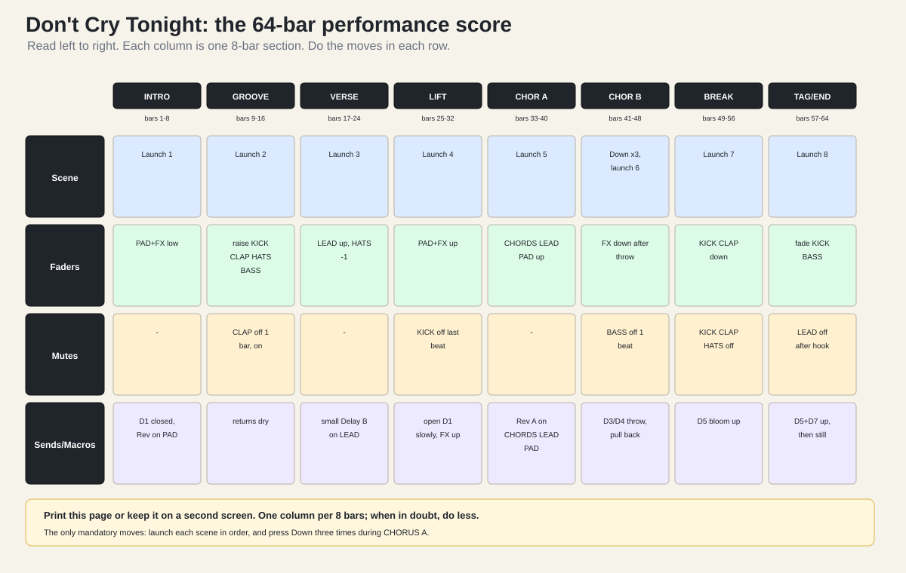{ width=100% }

Read it left to right, one column per 8-bar section. The only mandatory moves
are the Scene row (launch each scene in order, Down three times during
`CHORUS A`); everything else is optional garnish. When in doubt, do less.

## Record The Remix Study

Record a 64-bar performance:

1. Save the set.
2. Press Stop All Clips.
3. Put faders in starting positions.
4. Press Arrangement Record.
5. Press Play.
6. Perform scenes 1-8.
7. Use faders in every section.
8. Use at least three mutes.
9. Use one filter opening.
10. Use one delay throw.
11. Use one reverb tail.
12. Stop after the ending tail.
13. Switch to Arrangement View.
14. Save as `APC Dont Cry Tonight Practice 01 - recorded`.

Success is a 60-90 second practice edit first. Do not begin by trying to rebuild
the full 5:47 video. Once the 64-bar APC performance works, extend the set with
more scenes and variations.

## Export Your Take

A take that only lives inside a Live set does not feel finished. Export it:

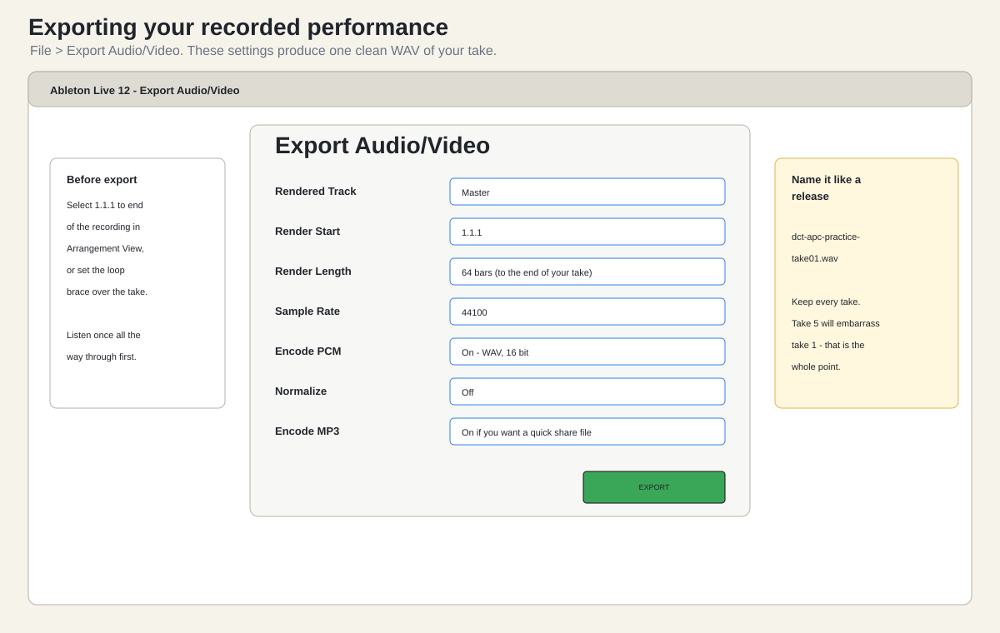{ width=100% }

1. In Arrangement View, listen to the recorded take once, all the way through.
2. Select from bar 1 to the end of the recording (click-drag in the beat-time
   ruler), or set the loop brace over the take.
3. Choose `File > Export Audio/Video`.
4. Rendered Track: `Master`. Sample rate: `44100`. WAV, 16 bit. Normalize off.
5. Name it like a release: `dct-apc-practice-take01.wav`.
6. Export, then play the WAV outside Ableton — in a music player, in
   headphones, on a phone speaker.

Keep every take. Take 5 will embarrass take 1; hearing that distance is the
most motivating progress report you can get.

> **Checkpoint.** You have a WAV file of your own 64-bar Don't Cry Tonight
> practice mix that plays outside Ableton. That file is the deliverable this
> whole book was building toward.

# Daily Practice Plan

## Day 1: Recognition And Grid

Goal: Ableton sees the APC and the grid launches clips.

Checklist:

1. APC lights up.
2. Live Settings show `APC40 mkII` as Control Surface.
3. Input and Output are set.
4. Session ring moves.
5. One clip launches.
6. One scene launches.
7. Stop All Clips works.

Stop after this if your brain is full. That is a valid first session.

## Day 2: Mixer

Goal: play the APC as a mixer.

Checklist:

1. Launch `GROOVE`.
2. Use faders only.
3. Add and remove percussion with a fader.
4. Mute `DRUMS` for one bar.
5. Unmute cleanly.
6. Fade to `END`.

## Day 3: Sends

Goal: understand wet/dry space.

Checklist:

1. Return A is Reverb.
2. Return B is Delay.
3. Sends mode controls Send A.
4. Hold Sends plus Track Selector selects Send B.
5. Add reverb to pads.
6. Add delay to trumpet or FX.
7. Keep kick and bass mostly dry.

## Day 4: Device Rack

Goal: one locked effect rack.

Checklist:

1. Create rack on `FX`.
2. Map eight macros.
3. Select track.
4. Select rack.
5. Lock device.
6. Perform one filter opening.
7. Perform one echo throw.

## Day 5: Record A Take

Goal: record one APC performance into Arrangement.

Checklist:

1. Save the set.
2. Arm Arrangement Record.
3. Perform the five scenes.
4. Stop twice.
5. Listen in Arrangement View.
6. Rename and save the recorded set.

# One-Page Performance Recipe

Use this exact recipe when you do not want to think.

1. Open `APC Oh Long Johnson Practice 01`.
2. Connect only APC40 MK2.
3. Confirm Settings: Control Surface `APC40 mkII`, Input `APC40 mkII`, Output
   `APC40 mkII`.
4. Set Global Quantization to `1 Bar`.
5. Press Stop All Clips.
6. Put faders low.
7. Launch `INTRO`.
8. Raise `PADS` and `FX`.
9. Launch `GROOVE`.
10. Raise `DRUMS`, `BASS`, and `PERC`.
11. Launch `HOOK`.
12. Raise `TRUMPET` and `HARMONY`.
13. Add a little Send A to `TRUMPET` and `PADS`.
14. Launch `BREAK`.
15. Mute `DRUMS`.
16. Open the filter on `FX`.
17. Launch `HOOK`.
18. Unmute `DRUMS`.
19. Launch `END`.
20. Fade `DRUMS` and `BASS`.
21. Let `PADS` and `FX` tail.
22. Press Stop All Clips.

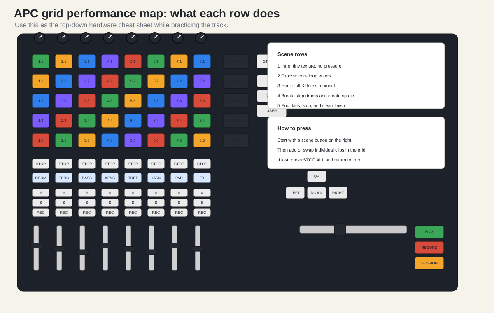{ width=100% }

# Troubleshooting

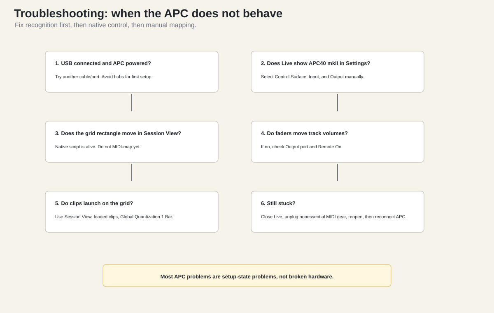{ width=100% }

## APC Lights Up, But Live Does Nothing

Likely cause: Ableton has not loaded the native control surface.

Fix:

1. Open Settings.
2. Go to Link, Tempo and MIDI.
3. Set Control Surface to `APC40 mkII`.
4. Set Input to `APC40 mkII`.
5. Set Output to `APC40 mkII`.
6. Close Settings.
7. Move the APC Bank arrows.
8. Look for the Session ring.

## Grid Launches Clips, But Faders Do Nothing

Likely cause: output feedback or control surface selection is wrong.

Fix:

1. Confirm the Control Surface row has both Input and Output.
2. Confirm `Remote` is On for APC input and output.
3. Create a fresh set with one track and one clip.
4. Test fader 1 on track volume.

## Faders Work, But Clip Buttons Do Nothing

Likely cause: you are not in Session View, or the APC ring is not over clips.

Fix:

1. Press Tab to switch to Session View.
2. Put clips inside the visible APC ring.
3. Use Bank arrows to move the ring.
4. Press a clip button that corresponds to a loaded slot.

## Clips Start Late

Likely cause: Global Quantization.

This is usually correct. If Global Quantization is `1 Bar`, clips wait until the
next bar. To test immediate launching, temporarily set quantization to `None`.
Then put it back to `1 Bar` for performance.

## Everything Is Too Loud

Likely cause: all faders are high, plus returns are adding level.

Fix:

1. Pull Master down slightly.
2. Pull FX and returns down.
3. Put kick, bass, and snare at sensible levels.
4. Add pads, harmony, and FX only after the groove is stable.

## Manual Mapping Broke Something

Likely cause: a User mode or MIDI Map assignment is overriding native behavior.

Fix:

1. Enter MIDI Map Mode.
2. Open the Mapping Browser.
3. Delete suspicious mappings.
4. Exit MIDI Map Mode.
5. Save a clean template before experimenting again.

# What To Ignore For Now

The APC40 MK2 can do more than this book covers. Ignore these until the APC-only
basics feel automatic:

- multiple APC controllers;
- deep User mode remapping;
- Max for Live control scripts;
- footswitch recording;
- complex Session Overview navigation;
- elaborate DJ racks;
- MPK integration;
- recording new MIDI parts from another controller;
- custom Python remote scripts.

That is not a limitation. It is how you get fluent faster.

# Final Check

You are ready to add the MPK later when you can do this without looking up the
steps:

1. Connect APC40 MK2.
2. Open Live 12.
3. Confirm native control surface setup.
4. Launch a scene.
5. Launch one individual clip.
6. Stop one track with Clip Stop.
7. Stop all clips.
8. Fade drums, bass, and pads.
9. Mute and unmute one track in time.
10. Select a track.
11. Control a device rack.
12. Add reverb or delay through Sends mode.
13. Record one performance pass into Arrangement.

Once those are easy, the MPK has a clean role: play new musical material. The
APC keeps the performance surface job: launch, arrange, mix, transition, and
record.
